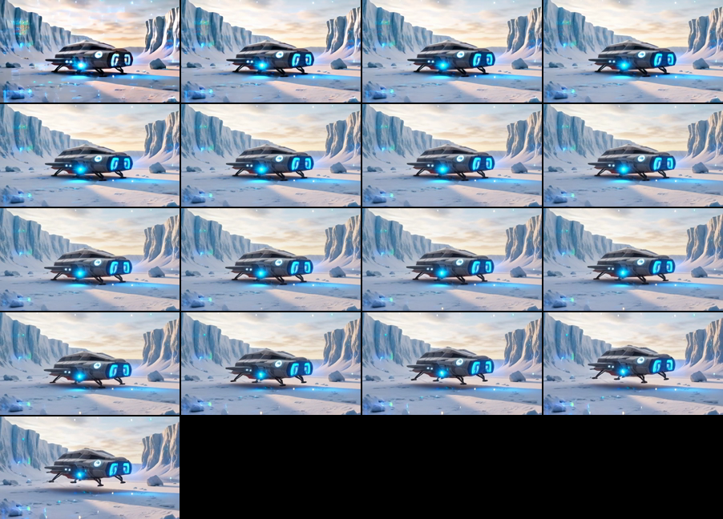

# Wan2.2 A14B Video-To-Video Proof Card

Prompt-guided plain video-to-video on `AbstractFramework/wan2.2-t2v-a14b-diffusers-8bit`:
one source clip plus one text prompt, run through unified `mlxgen generate`. The route,
command, and behavior contract live in [Wan video](../../../wan-video.md#video-to-video);
this card holds the reproducible proof artifacts.

## Source

17-frame lift-off clip from the spaceship-snow example set:
[06_i2v_a14b_spaceship_takeoff_from_source.mp4](../spaceship-snow/06_i2v_a14b_spaceship_takeoff_from_source.mp4)

## Output

Bounded diagnostic settings (`448x256`, `17` frames, `5` requested steps resolving to `3`
effective steps at `--video-strength 0.7`, seed `4242`): the ship is rebuilt as a bulkier
smuggler-style starship while the icy cliffs, snow haze, sunrise lighting, and camera motion
carry over from the source.

- output video: [starship_v2v_a14b.mp4](starship_v2v_a14b.mp4)
- run metadata: [starship_v2v_a14b.metadata.json](starship_v2v_a14b.metadata.json)
- exact command: see [Wan video](../../../wan-video.md#video-to-video); replay it from the
  metadata sidecar with `mlxgen generate -C starship_v2v_a14b.metadata.json`

## Verification Record

| Date | Version | Result |
| --- | --- | --- |
| 2026-07-18 | 0.23.0 | Re-ran the exact command: output bit-identical to the archived clip (0.00/255 mean abs diff on all 17 frames), `298.7 s` generation time, `13.8 GiB` peak RSS with `--low-ram` |
| (archived) | 0.18.24 | Original proof run, `221.3 s` generation time |

The route is seed-stable across releases: same command, same pixels.
