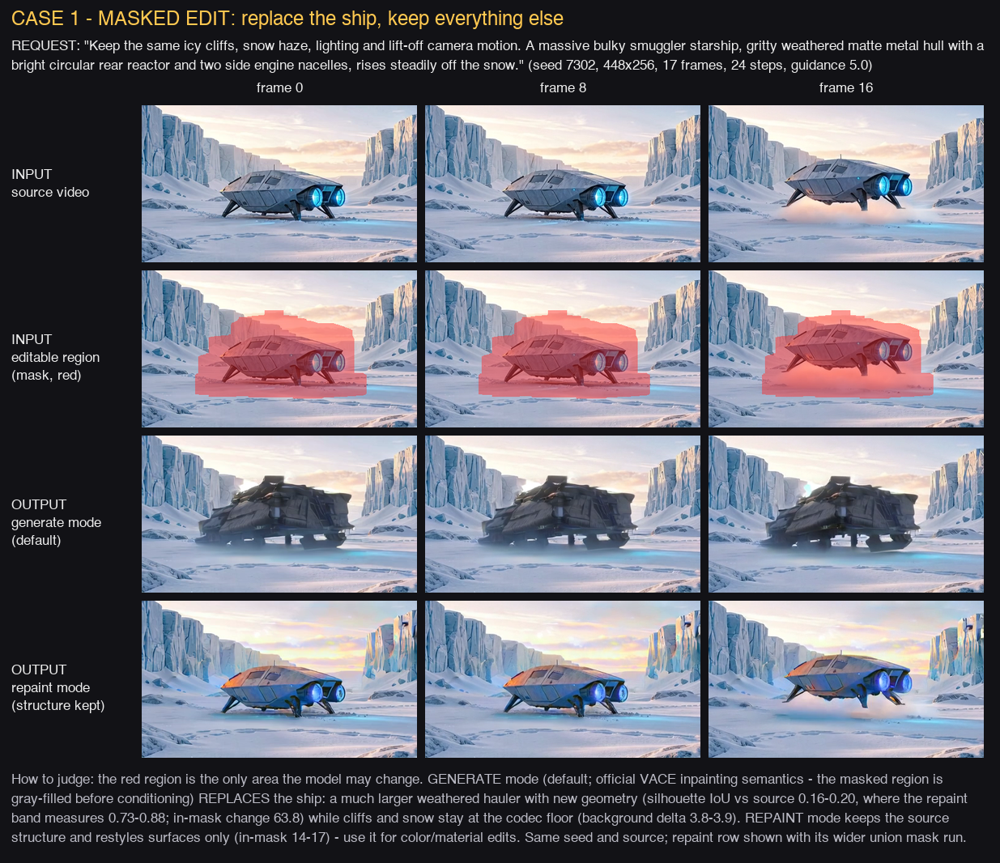
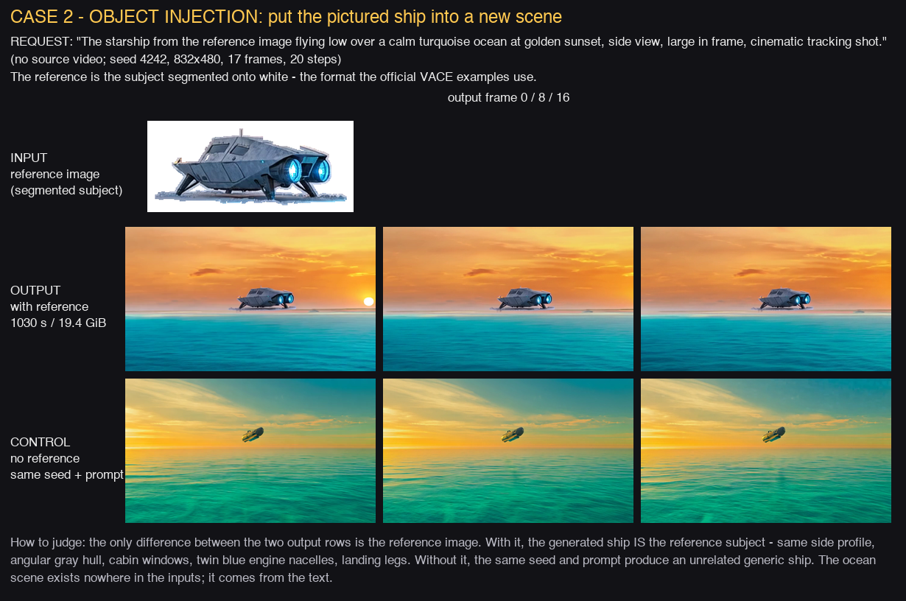
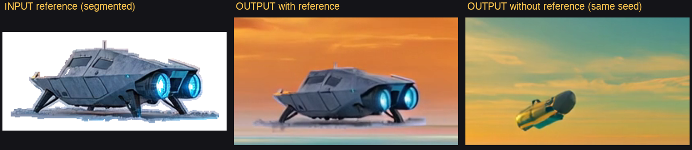

# Wan2.1-VACE-1.3B Native MLX Port - Proof Bundle (2026-07-06, corrected 2026-07-07)

Native MLX VACE on `Wan-AI/Wan2.1-VACE-1.3B-diffusers`, BF16, Apple Silicon: masked
source-video editing and reference-image object injection. Published mirror:
`docs/assets/validation/wan-vace-2026-07-06/`.

2026-07-07 correction: the first published cases were badly designed and their outputs did
not demonstrate the capability (near-identical ship in the masked edit; wrong ship in the
injection case). Both were re-run with corrected inputs plus controls, and an upstream
same-inputs A/B was added. The original artifacts are kept for the record and the failure
causes are documented below - they are user-relevant pitfalls.

Each case is presented as REQUEST -> INPUTS -> OUTPUT in one labeled panel.

## Why a Wan2.1 model

VACE is a Wan2.1-generation release: the only official Wan-AI VACE checkpoints are
`Wan2.1-VACE-1.3B` and `Wan2.1-VACE-14B`. There is no official Wan2.2 VACE (the community
`alibaba-pai/Wan2.2-VACE-Fun-A14B` is a PAI fine-tune of Wan2.2-T2V-A14B, 64 GB class, and
still decodes through the Wan2.1 VAE). The 1.3B checkpoint is the small official rung:
cheapest to port, validate, and iterate on. This is also the first Wan2.1 model in the
runtime - the architecture is the same family already shipped (A14B uses the Wan2.1
16-channel VAE and the same UMT5-XXL encoder), so the port adds the VACE control blocks, not
a new stack.

## Parity evidence (prerequisite for these runs)

`validation_outputs/wan_vace_parity/`: diffusers CPU fp32 reference tensors
(`tools/wan_vace_parity_export.py`) compared stage-by-stage against the MLX port
(`tools/wan_vace_parity_compare.py`). Results (adversarially verified, including an
independent rerun and a noise-floor sensitivity probe):

- mask-channel preparation: bit-exact (0.0), including random time-varying masks x 0/1/2
  reference images (pinned in `tests/wan/test_wan_vace.py`);
- VAE conditioning encode (inactive/reactive/reference): max_abs ~1.3e-4 fp32, up to
  ~9.5e-3 bf16;
- UniPC scheduler: bit-exact vs diffusers (timesteps, sigmas, and a synthetic step trace);
- transformer forward: fp32 max_abs 6.3e-3 at the model's own intrinsic sensitivity floor
  (injecting 1e-6 input noise produces a ~5.4e-3 output spread), i.e. cross-framework
  reduction-order noise, not structure;
- bounded 2-step CFG loop + decode: error amplification 10.9-14.5x, matching the analytic
  guidance-5/UniPC amplification model at both precisions.

Preserved artifacts: `compare_bf16.json` and `compare_fp32.json` (via the tool's `--fp32`
flag), mirrored next to this README as `parity_compare_bf16.json` /
`parity_compare_fp32.json`.

## Case 1 - masked edit: replace the ship, keep everything else



- REQUEST: a massive bulky smuggler starship with weathered matte hull, bright circular rear
  reactor and side nacelles, rising off the snow - while keeping cliffs, snow, lighting, and
  camera motion.
- INPUTS: the 17-frame lift-off source clip; one static mask tightly covering the ship's
  trajectory corridor (`ship_corridor_mask.png`, 27% of frame - built as the dilated union
  of per-frame ship silhouettes). No reference image.
- OUTPUT (generate mode, the default): `masked_edit_generate_v2.mp4` (24 steps, guidance
  5.0) - 1027.4 s, peak 12.1 GiB. The source ship is REPLACED by a much larger weathered
  hauler with new geometry, judged against a vision judge's strict acceptance criteria:
  ship-silhouette IoU vs source 0.16-0.20 (the repaint failure band measures 0.73-0.88; real
  geometry change calibrates at ~0.39), silhouette outgrowth 0.41-0.64 (bar: 0.25), in-mask
  change 63.8 (bar: 25), background delta 3.8-3.9 raw (bar: <= 6; H.264 codec floor ~2-4).
  Cliffs, sky, and snow away from the ship are unchanged.
- Earlier generate-mode iteration kept for the record: `masked_edit_generate_mode.mp4`
  (union mask, 16 steps, guidance 3.5) already replaced the ship (IoU ~0.40-0.52, in-mask
  39-42) but drew a compact pod instead of "bulkier" and recolored a cliff top inside the
  over-wide union mask - the vision judge failed it on those two counts; the tighter
  corridor mask, bulk-explicit prompt, 24 steps, and guidance 5.0 fixed both.
- CONTRAST (repaint mode): `ablation_m1_no_reference.mp4` (238.8 s) keeps the source
  structure as conditioning - same silhouette (IoU 0.80-0.88), restyled surfaces only
  (in-mask 14.5-16.7). This is the mode for recolor/restyle-in-place edits, not object
  replacement. Note: this run predates the `--vace-masked-region` flag (its sidecar has no
  `masked_region_mode`); replaying it via `--config-from-metadata` requires adding
  `--vace-masked-region repaint` explicitly, since the runtime default is now `generate`.

### Root cause of the earlier failures (kept for the record; adversarially diagnosed)

Two earlier published attempts did NOT satisfy the request, both correctly rejected in
review:

1. `ship_reactor_nacelles_mlx.mp4` passed the FIRST SOURCE FRAME as `--reference-image`,
   anchoring the ship to its own appearance (in-mask delta 8.0-10.9, visually
   near-identical).
2. `ablation_m1_no_reference.mp4` removed the self-reference but still fed the source ship
   pixels into the VACE reactive branch - which the model is trained to read as "repaint
   this structure" (silhouette IoU vs source 0.80; a vision judge measured real geometry
   change at ~0.39 on this metric). The official VACE convention (ali-vilab UserGuide,
   maintainer-confirmed in issue #107) gray-fills the editable region before encoding:
   gray = "missing, generate here". The upstream same-inputs A/B
   (`upstream_same_inputs_static_mask.mp4`, torch CPU fp32, 2160.5 s) fails the same way on
   un-blanked inputs - repaint plus whole-frame drift - confirming the input format, not the
   port, was at fault.

The runtime now implements the official convention as `--vace-masked-region generate`
(default) and keeps the old behavior as `repaint`.

Exact command (generate-mode case, the panel's canonical run):

```bash
uv run mlxgen-generate-wan --model Wan-AI/Wan2.1-VACE-1.3B-diffusers \
  --video-path docs/assets/examples/spaceship-snow/06_i2v_a14b_spaceship_takeoff_from_source.mp4 \
  --video-mask-path validation_outputs/wan_vace_mlx_2026_07_06/ship_corridor_mask.png \
  --prompt "Keep the same icy cliffs, snow haze, soft sunrise lighting, and lift-off camera motion. A massive bulky smuggler starship, wider and longer than the frame center, gritty weathered matte metal hull with a bright circular rear reactor and two side engine nacelles, rises steadily off the snow gaining altitude through the clip, photorealistic, film grain." \
  --negative-prompt "duplicate ships, warped hull, melted nacelles, unreadable reactor, washed out frame, blown highlights, iridescent, rainbow highlights, stylized, toon, painterly" \
  --width 448 --height 256 --fps 10 --frames 17 --steps 24 --guidance 5.0 \
  --seed 7302 --low-ram --metadata \
  --output validation_outputs/wan_vace_mlx_2026_07_06/masked_edit_generate_v2.mp4
```

Mask-building guidance proven by this case: keep the editable region a tight corridor around
the object's trajectory (dilated union of per-frame silhouettes). An over-wide mask hands the
model scenery it will re-render (the union-mask iteration recolored a cliff top that sat
inside the editable region).

## Case 2 - reference-image object injection, proven by same-seed control



- REQUEST: the pictured starship flying low over a turquoise ocean at golden sunset. No
  source video - the scene must come from the text.
- INPUTS: one reference image, the subject SEGMENTED onto a white background
  (`ship_segmented_reference.png`) - the format the official VACE examples use.
- OUTPUT: `ablation_r1_segmented_ref.mp4` (seed 4242, 832x480, 17 frames, 20 steps) -
  1030.0 s, peak 19.4 GiB. The generated ship is the reference subject: same side profile,
  angular gray hull, cabin windows, twin blue engine nacelles, landing legs.
- CONTROL: `ablation_r0_no_ref.mp4` - identical seed and prompt, NO reference - produces an
  unrelated generic ship (603.8 s). The reference branch, not the prompt, carries the
  identity. Zoomed three-way comparison: `identity_ablation_zoom.png`.



### Pitfalls discovered by the first attempts (kept for the record)

- `ship_r2v_ocean_closeup.mp4`: a rectangular CROP still containing glacier background
  produced only a style-level match (right materials, wrong shape). Segmenting the subject
  onto white fixed identity transfer.
- `ship_r2v_ocean.mp4` + `proof_reference_failure_panel.png`: a FULL-SCENE reference loses
  the subject entirely (a reddish speck floating on the water - effectively a text-to-video
  result). Guidance now in the docs: segment the subject; do not pass scene crops.

Exact command (corrected case):

```bash
uv run mlxgen-generate-wan --model Wan-AI/Wan2.1-VACE-1.3B-diffusers \
  --prompt "The starship from the reference image flying low over a calm turquoise ocean at golden sunset, side view, large in frame, cinematic tracking shot, photorealistic" \
  --negative-prompt "duplicate ships, warped hull, washed out frame, blown highlights, tiny distant object" \
  --reference-image validation_outputs/wan_vace_mlx_2026_07_06/ship_segmented_reference.png \
  --width 832 --height 480 --frames 17 --fps 16 --steps 20 --guidance 5.0 \
  --seed 4242 --low-ram --metadata \
  --output validation_outputs/wan_vace_mlx_2026_07_06/ablation_r1_segmented_ref.mp4
```

The control run is the same command without `--reference-image` (output
`ablation_r0_no_ref.mp4`).

## Defaults run - the flag-free first-user command

`ship_r2v_defaults_81f.mp4` (seed 7313, NO size/frame/step flags: 832x480, 81 frames,
30 steps, guidance 5.0, fps 16): a large, temporally stable armored hull over the ocean
across all 81 frames. Measured cost of the defaults on this host: 6948.6 s (~1 h 56 min),
peak 31.7 GiB. Contact sheet: `ship_r2v_defaults_contact_sheet.png`. Practical guidance:
iterate at 17-33 frames (~10-24 min) and scale up when the composition is right.

## Files

Committed mirror (`docs/assets/validation/wan-vace-2026-07-06/`): this README, the proof
panels (`proof_masked_edit_panel.png`, `proof_reference_injection_panel.png`,
`proof_reference_failure_panel.png`, `identity_ablation_zoom.png`), the case MP4s + sidecars
(`masked_edit_generate_v2`, `ablation_m1_no_reference` [repaint contrast],
`ablation_r1_segmented_ref`, `ablation_r0_no_ref`), `upstream_same_inputs_static_mask.mp4` +
`upstream_same_inputs.py`, the corridor and union masks, the segmented and raw reference
images, contact sheets, and the bf16 + fp32 parity JSONs.

Preserved locally (git-ignored): the superseded iteration artifacts
(`ship_reactor_nacelles_mlx.mp4`, `masked_edit_generate_mode.mp4`,
`ship_r2v_ocean_closeup.mp4`, `ship_r2v_ocean.mp4`, `exp_e1_scale06.mp4`,
`exp_e2_blanked.mp4`, `source_masked_region_blanked.mp4`), `smoke_r2v.mp4`,
`ship_r2v_defaults_81f.mp4` (contact sheet + sidecar mirrored), and
`validation_outputs/wan_vace_parity/reference.safetensors` (18.3 MB, regenerable).
