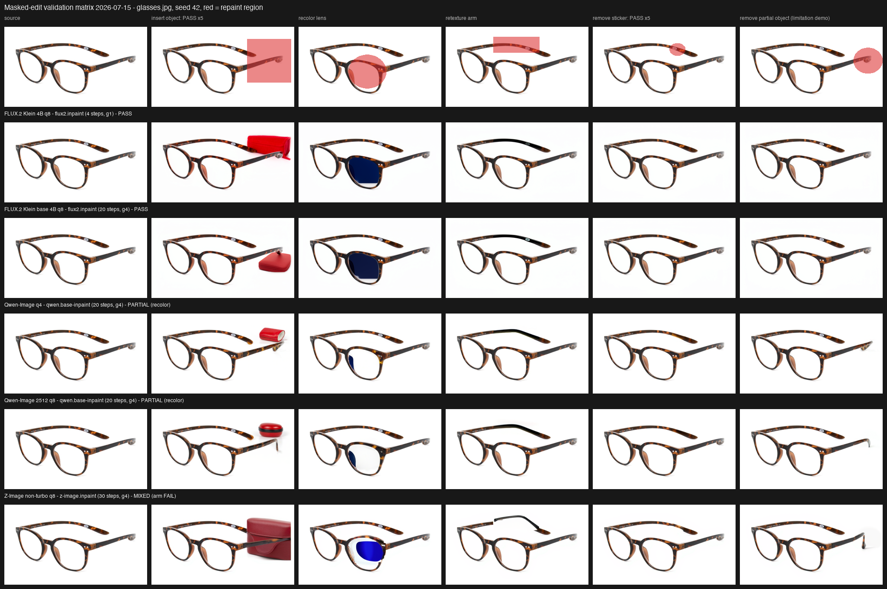

# Image Edit Capabilities

This page summarizes the current image-to-image edit contact sheets, command logs, and
model/package status for MLX-Gen. It separates these related concepts:

- `latent-img2img`: whole-image variation or restyle from one source image. `--image-strength`
  controls how far the output may drift.
- `edit-reference`: instruction editing from one source image, usually with stronger composition
  hold than latent img2img.
- `structured control`: text-to-image generation guided by a control image. This is separate from
  source-image edit/inpaint.
- `multi-reference`: two or more images are supplied as references for one composition.
- `generative reframe`: larger-view generation with `--reframe-padding`. This is a
  zoom-out style edit, not source-preserving outpaint.
- `canvas outpaint`: canvas extension with `--outpaint-padding`. Qwen Image Edit
  variants still use generative canvas expansion plus adaptive source restoration. FLUX.2 Klein
  base variants now use source-locked denoising and a narrow latent transition band instead of
  post-generation source pasting.

If you need a plain-language guide to choosing between these modes, see
[Image Edit Modes](image-edit-modes.md). For the current Qwen-specific route map and upstream
pipeline correspondence, see [Qwen route matrix](qwen-route-matrix.md).

Use `mlxgen capabilities --model <model>` to inspect route support before a run. Use the contact
sheets and status tables below when you need visual release evidence for exact source handles or
MLX-Gen optimized packages.

## Status Labels

| Status | Meaning |
| --- | --- |
| `PASS` | The row generated and the output visually satisfied the requested edit for this profile. |
| `PARTIAL` | The row generated and is usable for some work, but one requested constraint was weak. |
| `FAIL` | The row generated or routed, but the output did not satisfy the requested edit. |
| `STALE` | Historical evidence only. The row exists for review, but it is not the current contract. |

The canonical validation source image is
[`docs/assets/examples/spaceship-snow/01_t2i_spaceship_snow.png`](assets/examples/spaceship-snow/01_t2i_spaceship_snow.png).

## Regular Qwen Image Edit

`Qwen/Qwen-Image-Edit` is the original single-reference edit checkpoint. It supports
`edit-reference` with one input image. It does not support multi-reference composition; use
`Qwen/Qwen-Image-Edit-2509` or `Qwen/Qwen-Image-Edit-2511` for multi-reference edit routing.


| Model | Package | Capabilities validated | Result |
| --- | --- | --- | --- |
| `Qwen/Qwen-Image-Edit` | source | pencil sketch, crash edit | `PASS` |
| `AbstractFramework/qwen-image-edit-8bit` | q8 optimized variant | pencil sketch, crash edit | `PASS` |
| `AbstractFramework/qwen-image-edit-4bit` | mixed q4/q8 optimized variant | pencil sketch, crash edit | `PASS` |

These rows used a `768x432`, 30-step, guidance `4` profile with
`--scheduler flow_match_euler_discrete`.

## Qwen Masked Edit / Inpaint

MLX-Gen now exposes masked edit on the Qwen edit route through `--mask-path`. The current exact
accepted proof row is:

- `AbstractFramework/qwen-image-edit-2511-8bit` on `qwen.inpaint`

This first public proof is intentionally narrow. It validates the q8 route only, uses one source
image plus one mask at a time, and keeps the rest of the Qwen structured-control backlog separate
until those rows have their own visible proof.


| Model | Package | Capabilities validated | Result |
| --- | --- | --- | --- |
| `AbstractFramework/qwen-image-edit-2511-8bit` | q8 optimized variant | masked edit / inpaint with `--mask-path` | `PASS` |

The proof uses the dedicated `lightx2v/Qwen-Image-Edit-2511-Lightning` adapter as the recommended
fast public path for `4`-step masked edits. The published contact sheet compares the practical
regular `20`-step q8 path against the `4`-step Lightning path on two conditions:

- engine enhancement inside a small localized mask;
- crash repair inside a larger hull/cockpit mask.

MLX-Gen also publishes a same-canvas control sheet using the Lightning adapter in both result
columns. Those rows use the same `768x432` source image, the same prompt, the same seed, and the
same Lightning adapter. The only difference is `--mask-path`. Without `--mask-path`, the model is
free to recompose the whole scene, so framing drift is expected. With `--mask-path`, the edit
stays local:


Exact commands and timings:

- [masked edit command log](assets/validation/qwen-inpaint-2026-06-15/qwen2511_q8_inpaint_lightning_command_log.md)
- [masked edit timings on M5 Max](assets/validation/qwen-inpaint-2026-06-15/qwen2511_q8_inpaint_lightning_stats_m5max.json)

## Qwen Structured Control

MLX-Gen now exposes one exact Qwen structured-control route through
`--controlnet-image-path`. The current accepted public row is:

- `AbstractFramework/qwen-image-8bit` on `qwen.control`
- exact sidecar: `InstantX/Qwen-Image-ControlNet-Union:diffusion_pytorch_model.safetensors`

This slice is intentionally narrow. It is a text-to-image route with one control image, not a
source-image edit route. Base-Qwen localized control-inpaint now has its own separate validated row
below.


| Model | Package | Capabilities validated | Result |
| --- | --- | --- | --- |
| `AbstractFramework/qwen-image-8bit` | q8 optimized variant | structured control with `--controlnet-image-path` | `PASS` |

The accepted proof uses the dedicated `lightx2v/Qwen-Image-Lightning` adapter as the fast `4`-step
path and compares same-prompt, same-seed no-control versus controlled runs on two conditions:

- canny-guided pagoda layout;
- pose-guided portrait layout.

In both rows, the control image materially changes layout while the no-control baseline stays on
the same prompt, seed, and Lightning adapter. That is the proof that the control image is doing
real work rather than only the prompt carrying the scene.

Exact commands and timings:

- [structured-control command log](assets/validation/qwen-control-2026-06-15/qwen_q8_control_lightning_command_log.md)
- [structured-control timings on M5 Max](assets/validation/qwen-control-2026-06-15/qwen_q8_control_lightning_stats_m5max.json)

## Qwen Base Control-Inpaint

MLX-Gen now exposes one exact base-Qwen localized control-inpaint route through the same public
`image + mask + prompt` request shape. The current accepted public row is:

- `AbstractFramework/qwen-image-8bit` on `qwen.control-inpaint`
- exact sidecar:
  `InstantX/Qwen-Image-ControlNet-Inpainting:diffusion_pytorch_model.safetensors`

This route is different from Qwen edit masked inpaint. It keeps the generic `--mask-path` user
contract, but the backend is the base Qwen model plus the dedicated inpainting ControlNet sidecar.


| Model | Package | Capabilities validated | Result |
| --- | --- | --- | --- |
| `AbstractFramework/qwen-image-8bit` | q8 optimized variant | base-Qwen control-inpaint with `--mask-path` | `PASS` |

The accepted proof is still narrow and exact:

- same `768x432` source image, mask, prompt, and seed across the comparison row;
- exact Qwen Lightning `4`-step fast path;
- two localized conditions: engine enhancement and crash repair.

Published artifacts:

- [control-inpaint report](assets/validation/qwen-control-inpaint-2026-06-21/qwen_control_inpaint_report.md)
- [control-inpaint command log](assets/validation/qwen-control-inpaint-2026-06-21/qwen_control_inpaint_command_log.md)
- [control-inpaint timings on M5 Max](assets/validation/qwen-control-inpaint-2026-06-21/qwen_control_inpaint_stats_m5max.json)

## Qwen 2509 And Distilled FLUX.2 Matrix

The 5x4 edit validation profile tests the same spaceship source across:

- `B`: cinematic latent/style variation;
- `C`: crash edit from the source image;
- `D`: pencil sketch edit;
- `E`: multi-reference composition from the model's own pencil/crash and cinematic rows.

| Family | Exact handles/packages | Modes validated | Result summary | Contact sheet |
| --- | --- | --- | --- | --- |
| FLUX.2 Klein 4B distilled | `black-forest-labs/FLUX.2-klein-4B`, `AbstractFramework/flux.2-klein-4b-8bit`, `AbstractFramework/flux.2-klein-4b-4bit` | `latent-img2img`, `edit-reference`, `multi-reference` | source, q8, and q4 passed B/C/D/E | [matrix](assets/validation/i2i-edit-5x4-2026-06-05/flux2-klein-4b-variant-matrix.jpg) |
| FLUX.2 Klein 9B distilled | `black-forest-labs/FLUX.2-klein-9B`, `AbstractFramework/flux.2-klein-9b-8bit`, `AbstractFramework/flux.2-klein-9b-4bit` | `latent-img2img`, `edit-reference`, `multi-reference` | source, q8, and q4 passed B/C/D/E | [matrix](assets/validation/i2i-edit-5x4-2026-06-05/flux2-klein-9b-variant-matrix.jpg) |
| Qwen Image Edit 2509 | `Qwen/Qwen-Image-Edit-2509`, `AbstractFramework/qwen-image-edit-2509-8bit`, `AbstractFramework/qwen-image-edit-2509-4bit` | `edit-reference`, `multi-reference` | source and q8 passed B/C/D/E; q4 passed B/C/D and was partial on E | [matrix](assets/validation/i2i-edit-5x4-2026-06-05/qwen-image-edit-2509-variant-matrix.jpg) |
| Qwen Image Edit 2511 | `Qwen/Qwen-Image-Edit-2511`, `AbstractFramework/qwen-image-edit-2511-8bit`, `AbstractFramework/qwen-image-edit-2511-4bit` | `edit-reference`, `multi-reference` | source, q8, and q4 passed the 2026-06-06 pencil/crash/composition profile | [matrix](assets/validation/qwen-edit-2511-parity-2026-06-06/qwen-image-edit-2511-source-q8-q4-parity.jpg) |
| FIBO Edit | `briaai/Fibo-Edit` | Not supported through unified `mlxgen generate` | no public image-edit support in the current release; capability discovery fails closed | N/A |

Base FLUX.2 Klein source models now have a separate starship proof set because their current
canvas-expansion contract is different: strict outpaint is base-only, and base models do not expose
reframe.

## Reframe And Outpaint

`--reframe-padding` and `--outpaint-padding` are single-image edit-reference routes. Reframe is a
generative zoom-out workflow. Outpaint now splits by backend: Qwen Image Edit still
uses generative canvas expansion plus adaptive source restoration, while FLUX.2 strict outpaint is
limited to base Klein models and uses source-locked denoising with an interior transition band.

Exact LoRA-backed public proof now exists for:

- `AbstractFramework/qwen-image-edit-2511-8bit` on `qwen.reframe`
- `AbstractFramework/qwen-image-edit-2511-8bit` on `qwen.outpaint`
- `AbstractFramework/flux.2-klein-base-4b-8bit` on `flux2.outpaint`

See [LoRA](lora.md) for those exact route-level A/B sheets.


| Family | Exact handles/packages | Reframe | Outpaint | Contact sheet |
| --- | --- | --- | --- | --- |
| Qwen Image Edit | `Qwen/Qwen-Image-Edit`, `AbstractFramework/qwen-image-edit-8bit`, `AbstractFramework/qwen-image-edit-4bit` | source/q8/q4 `PASS` | source/q8/q4 `PASS` | [matrix](assets/validation/reframe-outpaint-2026-06-08/qwen-image-edit-reframe-outpaint-matrix.jpg) |
| Qwen Image Edit 2509 | `Qwen/Qwen-Image-Edit-2509`, `AbstractFramework/qwen-image-edit-2509-8bit`, `AbstractFramework/qwen-image-edit-2509-4bit` | source/q8/q4 `PASS` | source/q8/q4 `PASS` | [matrix](assets/validation/reframe-outpaint-2026-06-08/qwen-image-edit-2509-reframe-outpaint-matrix.jpg) |
| Qwen Image Edit 2511 | `Qwen/Qwen-Image-Edit-2511`, `AbstractFramework/qwen-image-edit-2511-8bit`, `AbstractFramework/qwen-image-edit-2511-4bit` | source/q8/q4 `PASS` | source/q8/q4 `PASS` | [matrix](assets/validation/reframe-outpaint-2026-06-08/qwen-image-edit-2511-reframe-outpaint-matrix.jpg) |
| FLUX.2 Klein 4B | `black-forest-labs/FLUX.2-klein-4B`, `AbstractFramework/flux.2-klein-4b-8bit`, `AbstractFramework/flux.2-klein-4b-4bit` | source/q8/q4 `PASS` | historical rows `STALE` | [matrix](assets/validation/reframe-outpaint-2026-06-08/flux2-klein-4b-reframe-outpaint-matrix.jpg) |
| FLUX.2 Klein 9B | `black-forest-labs/FLUX.2-klein-9B`, `AbstractFramework/flux.2-klein-9b-8bit`, `AbstractFramework/flux.2-klein-9b-4bit` | source/q8/q4 `PASS` | historical rows `STALE` | [matrix](assets/validation/reframe-outpaint-2026-06-08/flux2-klein-9b-reframe-outpaint-matrix.jpg) |
| FLUX.2 Klein Base 9B | `black-forest-labs/FLUX.2-klein-base-9B`, `AbstractFramework/flux.2-klein-base-9b-8bit`, `AbstractFramework/flux.2-klein-base-9b-4bit` | not exposed | source `PASS`; prepared package proof pending | [edit matrix](assets/validation/flux2-klein-base-starship-2026-06-10/flux2-klein-base-starship-edit-matrix.jpg), [seams](assets/validation/flux2-klein-base-starship-2026-06-10/flux2-klein-base-starship-outpaint-seams.jpg) |
| FLUX.2 Klein Base 4B | `black-forest-labs/FLUX.2-klein-base-4B`, `AbstractFramework/flux.2-klein-base-4b-8bit`, `AbstractFramework/flux.2-klein-base-4b-4bit` | not exposed | source `PASS`; multi-reference row `PARTIAL`; prepared package proof pending | [edit matrix](assets/validation/flux2-klein-base-starship-2026-06-10/flux2-klein-base-starship-edit-matrix.jpg), [seams](assets/validation/flux2-klein-base-starship-2026-06-10/flux2-klein-base-starship-outpaint-seams.jpg) |

Current strict FLUX.2 outpaint requires `black-forest-labs/FLUX.2-klein-base-*`. Prepared base
Klein q8/q4 packages expose the same route surface through `mlxgen capabilities`, but their
starship contact-sheet proof is still pending. Base Klein reframe is intentionally rejected.

Use the dedicated [Reframe and Outpaint](reframe-outpaint.md) guide for copy/pasteable examples,
canvas/mask assets, the validation manifests, and exact commands. The mixed June 8 profile id is
`reframe_outpaint_2026_06_08`; the current FLUX.2 Klein base source-model profile id is
`flux2_klein_base_starship_2026_06_10`.

These workflows are not native masked fill/inpaint pipelines. Reframe remains openly generative.
Strict FLUX.2 base outpaint aims to keep the source crop stable, but still relies on latent-space
editing rather than direct pixel masking.

### FLUX.2 Klein 4B

This matrix validates source, q8, and q4 packages on the same canonical spaceship source. The
columns cover the standardized sequence: source image, cinematic latent variation, hard-landing
edit, pencil-sketch edit, and multi-reference composition.


### FLUX.2 Klein 9B

This matrix validates source, q8, and q4 packages on the same canonical spaceship source. The
columns cover the same standardized sequence as Klein 4B so the two model sizes can be compared
directly.


### FLUX.2 Klein Base 4B And 9B Source Proof

The current base-model proof uses the cropped starship source across source-model base `4B/9B`
only. It validates latent img2img, single-image edit-reference, multi-reference, and strict
outpaint on the same starship case. Source-model text-to-image smoke is published separately.


The dedicated seam-review sheet zooms the source-window boundaries for the strict outpaint rows:


Source-model text-to-image smoke:


### Qwen Image Edit 2509

This matrix validates the Qwen Image Edit 2509 source checkpoint plus q8 and q4 MLX-Gen optimized packages. Source
and q8 pass the full standardized edit-reference and multi-reference sequence; q4 remains partial
on the multi-reference composition row in this profile.


### Qwen Image Edit 2511

The current Qwen Image Edit 2511 proof uses the same source image across the upstream source
checkpoint, the q8 MLX-Gen package, and the q4 MLX-Gen package. The profile validates a
single-image pencil sketch, a single-image hard-landing crash edit, and a two-reference composition
from the generated pencil and crash images.


### FIBO Edit

FIBO Edit is not a supported public image-edit route in MLX-Gen at the moment.
`mlxgen capabilities --model briaai/Fibo-Edit` exposes no unified generation capabilities for this
model. The dedicated compatibility command remains for maintainer parity work, but user-facing
image editing should use Qwen Image Edit, Qwen Image Edit 2509/2511, or FLUX.2 Klein routes with passing
contact sheets.

## Latent I2I Only

Some image models support latent image-to-image variation but are not edit/reference models. In the
standard spaceship profile, `Z-Image Turbo` and `ERNIE Image Turbo` q4/q8 packages passed the
single latent cinematic variation row. `Qwen Image 2512` q4/q8 ran the latent route but did not
preserve the spaceship identity for this prompt, so it is not documented here as a good edit model.

Use latent I2I for style/variation workflows, not precise composition or object-state editing:

```sh
mlxgen generate \
  --model AbstractFramework/z-image-turbo-8bit \
  --image docs/assets/examples/spaceship-snow/01_t2i_spaceship_snow.png \
  --i2i-mode latent \
  --image-strength 0.35 \
  --prompt "Make this same spaceship in the snow look like polished cinematic science-fiction concept art at blue hour. Preserve the exact camera angle, ship position, snowy canyon, and overall layout. Sharpen hull panels and add cold blue shadows; no crash, no damage." \
  --width 432 \
  --height 240 \
  --steps 20 \
  --seed 9201 \
  --output output.png
```

## Z-Image Turbo Native Inpaint

Z-Image Turbo now has one exact native inpaint proof row through unified `mlxgen generate`:

- `AbstractFramework/z-image-turbo-8bit` on `z-image.inpaint`

This is intentionally narrower than the Qwen edit surface. The accepted public proof is one
same-prompt same-seed engine-thruster case that compares the old latent route against the new mask
route on the same source image.


| Model | Package | Capabilities validated | Result |
| --- | --- | --- | --- |
| `AbstractFramework/z-image-turbo-8bit` | q8 optimized variant | native inpaint with `--mask-path` | `PASS` |

The accepted row compares:

- latent baseline: same source, prompt, and seed with `--image-strength 0.35`
- native inpaint: same source, prompt, and seed with `--mask-path`

The masked-area crop sheet is published separately because that is where the route difference is
most readable:


Published artifacts:

- [native-inpaint report](assets/validation/zimage-inpaint-2026-06-21/zimage_inpaint_report.md)
- [native-inpaint command log](assets/validation/zimage-inpaint-2026-06-21/zimage_inpaint_command_log.md)
- [native-inpaint timings on M5 Max](assets/validation/zimage-inpaint-2026-06-21/zimage_inpaint_stats_m5max.json)

## Masked Edit 5x5 Matrix (FLUX.2 Klein, Base Qwen, Z-Image Non-Turbo)

The masked-edit routes shipped in 0.20.0/0.21.0 have a standardized multi-case matrix: one
shared source, five masks (object insertion, lens recolor, arm retexture, sticker removal, and
an unscored partial-object-removal limitation demonstration), same seed, five exact rows.



| Model | Route | insert | recolor | retexture | sticker removal | Aggregate |
| --- | --- | --- | --- | --- | --- | --- |
| `AbstractFramework/flux.2-klein-4b-8bit` | `flux2.inpaint` | `PASS` | `PASS` | `PASS` | `PASS` | `PASS` |
| `AbstractFramework/flux.2-klein-base-4b-8bit` | `flux2.inpaint` | `PASS` | `PASS` | `PASS` | `PASS` | `PASS` |
| `Qwen/Qwen-Image` (source bf16) | `qwen.base-inpaint` | `PASS` | `PARTIAL` | `PASS` | `PASS` | `PARTIAL` |
| `AbstractFramework/qwen-image-4bit` | `qwen.base-inpaint` | `PASS` | `PARTIAL` | `PASS` | `PASS` | `PARTIAL` |
| `AbstractFramework/qwen-image-2512-8bit` | `qwen.base-inpaint` | `PASS` | `PARTIAL` | `PASS` | `PASS` | `PARTIAL` |
| `AbstractFramework/z-image-8bit` | `z-image.inpaint` | `PASS` | `PARTIAL` | `FAIL` | `PASS` | `FAIL` |

The PARTIAL and FAIL cells are documented behavior, not gaps in the proof, and both led to
shipped consequences: the base-Qwen warm start anchors masked content to the source at the
default `--mask-strength 0.85` (the measured `0.95` setting recolors fully — s095 regression
sheet in the bundle), and the non-turbo Z-Image geometry artifact reproduced across seeds and
CFG settings, so non-turbo Z-Image masked editing is withdrawn from the public surface for the
moment (the row above stays as the withdrawal evidence). See
[Masked editing](masked-editing.md) for route-selection advice and the
[matrix bundle](assets/validation/masked-edit-matrix-2026-07-15/README.md) for zoom sheets,
preservation metrics, prompts, and the seed-43 reproduction of the Z-Image failure. Registry
profile: `masked_edit_matrix_5x5_2026_07_15`.

## Exact Validation Commands

The full command logs are published with the proof assets:

- [regular Qwen Image Edit command log](assets/validation/i2i-edit-5x4-2026-06-05/qwen-image-edit-command-log.md)
- [Qwen Image Edit 2511 parity command log](assets/validation/qwen-edit-2511-parity-2026-06-06/qwen-image-edit-2511-command-log.md)
- [Qwen Image Edit 2511 masked edit command log](assets/validation/qwen-inpaint-2026-06-15/qwen2511_q8_inpaint_lightning_command_log.md)
- [Qwen base control-inpaint command log](assets/validation/qwen-control-inpaint-2026-06-21/qwen_control_inpaint_command_log.md)
- [Z-Image Turbo native inpaint command log](assets/validation/zimage-inpaint-2026-06-21/zimage_inpaint_command_log.md)
- [5x4 FLUX.2 and Qwen Image Edit 2509 command log](assets/validation/i2i-edit-5x4-2026-06-05/edit-capability-command-log.md)
- [reframe and outpaint command log](assets/validation/reframe-outpaint-2026-06-08/reframe-outpaint-command-log.md)
- [FLUX.2 Klein base starship command log](assets/validation/flux2-klein-base-starship-2026-06-10/flux2-klein-base-starship-command-log.md)
- [latent I2I command log](assets/validation/i2i-edit-5x4-2026-06-05/latent-i2i-command-log.md)
