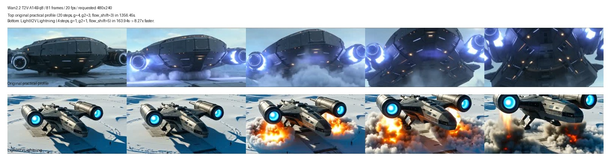
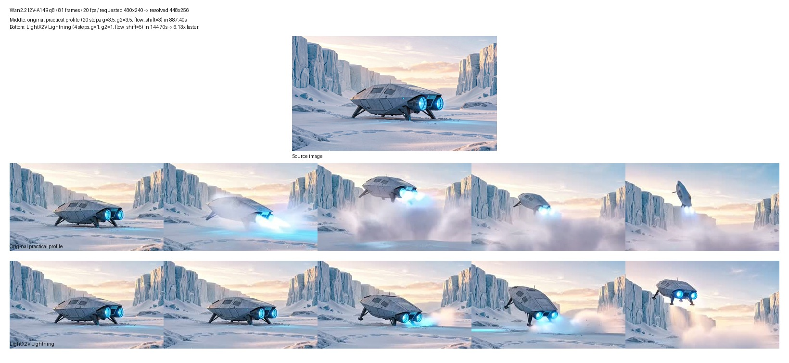
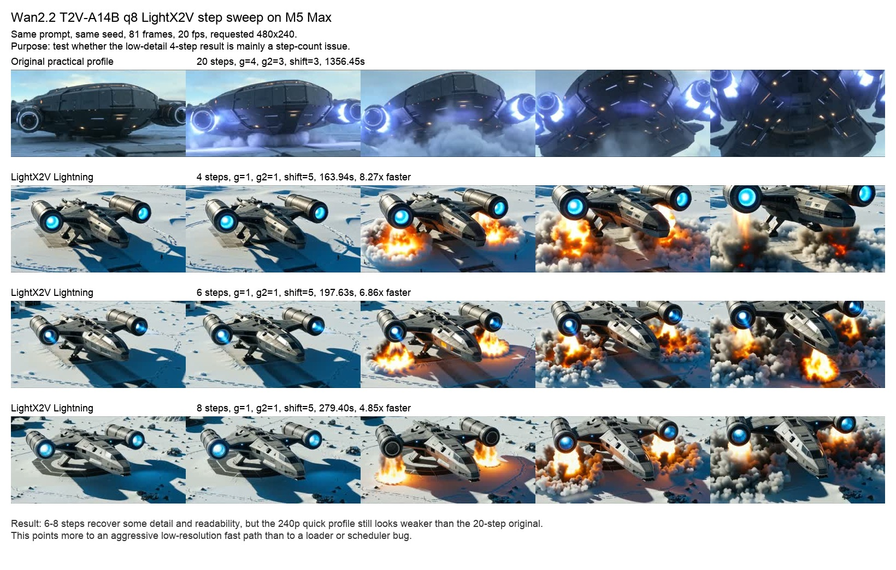
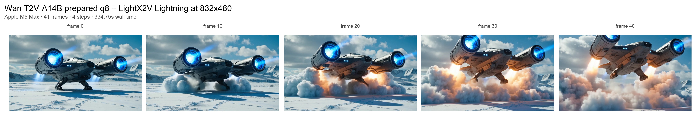

# LoRA

LoRA support in MLX-Gen is experimental. MLX-Gen accepts LoRA adapters only when the selected route
can apply them to the model transformer. A requested LoRA is required input: missing files,
unreadable files, incompatible matrix shapes, zero matched keys, and unsupported model families fail
before or during model setup instead of continuing without the adapter.

## Check Support First

Use `mlxgen capabilities` before starting a LoRA run:

```sh
mlxgen capabilities --model AbstractFramework/flux.2-klein-4b-8bit
```

Each capability row includes:

| Field | Meaning |
| --- | --- |
| `supports_lora` | Whether the route accepts LoRA arguments. |
| `lora_status` | `unsupported`, `mapped-unvalidated`, or `validated`. |
| `lora_target_roles` | Model components targeted by adapters, such as `transformer`. |
| `lora_validation_profile` | Validation profile id when the exact route has model-backed proof. |

`mapped-unvalidated` means MLX-Gen has a loader and mapping for the route, but that exact
model/package and task has not yet passed a visible A/B validation with an accepted adapter. Treat
LoRA routes as experimental unless a current A/B contact sheet demonstrates the intended adapter
effect for your selected model/package.

Generated output metadata now records what actually applied, not only what was requested:
`lora_application_reports`, `lora_applied_file_count`, and `lora_applied_target_count`.

When a capability row reports `lora_validation_profile`, you can inspect the accepted proof row
directly:

```sh
mlxgen validation \
  --model AbstractFramework/qwen-image-edit-8bit \
  --profile lora_qwen_edit_q8_ghibli_edit_2026_06_11
```

## Current Support Snapshot

The current LoRA surface is route-specific:

| Route family | Current status |
| --- | --- |
| `AbstractFramework/qwen-image-edit-2511-8bit`, `AbstractFramework/qwen-image-edit-2509-8bit`, `AbstractFramework/qwen-image-edit-8bit`, `AbstractFramework/qwen-image-2512-8bit`, `AbstractFramework/z-image-turbo-8bit`, `AbstractFramework/flux.2-klein-9b-8bit` edit, `AbstractFramework/ernie-image-turbo-8bit` text-to-image | Exact validated q8 proof rows exist. |
| Base Qwen Image, Qwen multi-reference or canvas rows, Z-Image latent img2img, ERNIE latent img2img, and the remaining FLUX.2 package rows | `mapped-unvalidated`: the mapping works, but the exact route still lacks a strong public A/B proof. |
| `AbstractFramework/wan2.2-ti2v-5b-diffusers-8bit` text-to-video, `AbstractFramework/wan2.2-ti2v-5b-diffusers-8bit` first-frame image-to-video, `AbstractFramework/wan2.2-t2v-a14b-diffusers-8bit` text-to-video, and `AbstractFramework/wan2.2-i2v-a14b-diffusers-8bit` first-frame image-to-video | Exact validated q8 proof rows exist. |
| SeedVR2, FIBO | Unsupported today. |
| Bonsai | Unsupported and low priority. The current packed runtime does not expose the ordinary replaceable linear-module boundary that MLX-Gen's LoRA loader requires. |

## Download And Reference Adapters

Generation does not download LoRA files. Download the adapter repository explicitly:

```sh
mlxgen download --model lovis93/Flux-2-Multi-Angles-LoRA-v2 --all-files
```

Use a local `.safetensors` path or a Hugging Face repository id. If the repository contains several
adapter files, specify the file after a colon:

```sh
mlxgen generate \
  --model <compatible-model> \
  --prompt "<prompt from the adapter model card>" \
  --lora-paths owner/repo:adapter.safetensors \
  --lora-scales 0.9 \
  --output with_lora.png
```

The number of `--lora-scales` values must match the number of `--lora-paths` values. Passing scales
without paths fails before model load.

## Adapter Compatibility

Read the adapter model card and match its base model. A LoRA trained for one FLUX.2 variant is not
automatically compatible with another FLUX.2 variant.

The downloaded `lovis93/Flux-2-Multi-Angles-LoRA-v2` adapter targets
`black-forest-labs/FLUX.2-dev`, uses prompts that start with `<sks>`, and recommends adapter
strength around `0.8` to `1.0`. MLX-Gen currently supports FLUX.2 Klein 4B/9B, not
`black-forest-labs/FLUX.2-dev`. Passing this adapter to FLUX.2 Klein is rejected because the LoRA
matrices target a different transformer width.

Wan video LoRA is now available on the Wan routes that expose transformer LoRA targets. TI2V-5B
uses one role, `transformer`. Wan A14B uses two explicit roles, `high_noise_transformer` and
`low_noise_transformer`. MLX-Gen does not guess or silently duplicate roles for dual-transformer
A14B requests: callers must pass the intended role assignment explicitly with `--lora-target-roles`.

The Wan loader now accepts Diffusers-style Wan adapters, non-Diffusers Wan adapter keys, and
Musubi/Kohya-style Wan keys. For I2V-capable Wan transformers, MLX-Gen also mirrors Diffusers'
T2V-to-I2V expansion behavior by synthesizing zero LoRA tensors for missing image-projection
families when a T2V adapter is loaded on an I2V route. The remaining validation problem is not
basic loading; it is whether a given adapter produces a strong enough MP4 A/B to promote
that exact route from `mapped-unvalidated` to `validated`.

The downloaded `fal/Qwen-Image-Edit-2511-Multiple-Angles-LoRA` adapter targets
`Qwen/Qwen-Image-Edit-2511` and uses `<sks>` multi-angle prompt wording. MLX-Gen validates the
adapter against `AbstractFramework/qwen-image-edit-2511-8bit` through the public `mlxgen generate`
route. On the spaceship source below, base Qwen 2511 already follows many viewpoint prompts, so the
LoRA effect is visible but modest.


The first pair used:

```sh
mlxgen generate \
  --model AbstractFramework/qwen-image-edit-2511-8bit \
  --image docs/assets/examples/spaceship-snow/01_t2i_spaceship_snow.png \
  --prompt "Use the source spaceship as the same object. <sks> back view low-angle shot wide shot. Re-render the scene from behind the spaceship at a low camera angle, keeping the icy canyon and the same vehicle design. No text, no watermark, no blur." \
  --negative "front view, same camera angle, cropped spaceship, text, watermark, blur, duplicate spaceship" \
  --width 432 \
  --height 240 \
  --steps 24 \
  --guidance 4 \
  --seed 9701 \
  --metadata \
  --replace \
  --output validation_outputs/lora_multi_angle_2026_06_08/qwen2511_q8_no_lora_back_low_wide.png \
  --i2i-mode edit

mlxgen generate \
  --model AbstractFramework/qwen-image-edit-2511-8bit \
  --image docs/assets/examples/spaceship-snow/01_t2i_spaceship_snow.png \
  --prompt "Use the source spaceship as the same object. <sks> back view low-angle shot wide shot. Re-render the scene from behind the spaceship at a low camera angle, keeping the icy canyon and the same vehicle design. No text, no watermark, no blur." \
  --negative "front view, same camera angle, cropped spaceship, text, watermark, blur, duplicate spaceship" \
  --width 432 \
  --height 240 \
  --steps 24 \
  --guidance 4 \
  --seed 9701 \
  --metadata \
  --replace \
  --output validation_outputs/lora_multi_angle_2026_06_08/qwen2511_q8_with_lora_back_low_wide.png \
  --i2i-mode edit \
  --lora-paths fal/Qwen-Image-Edit-2511-Multiple-Angles-LoRA:qwen-image-edit-2511-multiple-angles-lora.safetensors \
  --lora-scales 0.9
```

The second pair used the same settings with `--prompt "<sks> front view high-angle shot close-up"`,
`--seed 9702`, and matching `no_lora_front_high_close.png` / `with_lora_front_high_close.png`
outputs. The LoRA loader matched and applied all `1,680` adapter tensors for both LoRA runs.

`AbstractFramework/qwen-image-edit-2509-8bit` now has an exact single-image edit proof with the
stacked `lightx2v/Qwen-Image-Lightning` plus `dx8152/Qwen-Edit-2509-Multiple-angles` path. This
row is validated for `qwen.edit` only. The validated profile uses the Lightning-style settings from
the public workflow: `8` steps and `guidance 1`.


Commands:

```sh
mlxgen generate \
  --model AbstractFramework/qwen-image-edit-2509-8bit \
  --image docs/assets/examples/spaceship-snow/01_t2i_spaceship_snow.png \
  --prompt "Move the camera to the right. Rotate the camera 45 degrees to the right. Turn the camera to a wide-angle shot. Keep the same spaceship design, the icy canyon, the rear engines, and the wide scene composition. No text, no watermark, no blur." \
  --width 432 \
  --height 240 \
  --steps 8 \
  --guidance 1 \
  --seed 9901 \
  --metadata \
  --replace \
  --output validation_outputs/lora_strict_2026_06_11/qwen2509_q8_no_lora_angle_g1.png \
  --i2i-mode edit

mlxgen generate \
  --model AbstractFramework/qwen-image-edit-2509-8bit \
  --image docs/assets/examples/spaceship-snow/01_t2i_spaceship_snow.png \
  --prompt "Move the camera to the right. Rotate the camera 45 degrees to the right. Turn the camera to a wide-angle shot. Keep the same spaceship design, the icy canyon, the rear engines, and the wide scene composition. No text, no watermark, no blur." \
  --width 432 \
  --height 240 \
  --steps 8 \
  --guidance 1 \
  --seed 9901 \
  --metadata \
  --replace \
  --output validation_outputs/lora_strict_2026_06_11/qwen2509_q8_with_lora_angle_g1.png \
  --i2i-mode edit \
  --lora-paths /Users/albou/.cache/huggingface/hub/models--lightx2v--Qwen-Image-Lightning/snapshots/e74da8d4e71a54b341de86aa9f8d2509165aa513/Qwen-Image-Edit-2509/Qwen-Image-Edit-2509-Lightning-8steps-V1.0-bf16.safetensors dx8152/Qwen-Edit-2509-Multiple-angles:镜头转换.safetensors \
  --lora-scales 1.0 0.9
```

The corrected MLX-Gen mapping now matches all `1,440` tensors in `镜头转换.safetensors` and all
`2,160` tensors in the stacked Lightning adapter on this route.

`AbstractFramework/qwen-image-edit-8bit` now has an exact single-image edit proof with a
Ghibli-style Qwen adapter. This row is validated for `qwen.edit` only. The current accepted proof
uses `ghibli_style_qwen_v3.safetensors` on same-seed edit trials and produces a visible style
shift while keeping the edit route stable.


Representative command:

```sh
mlxgen generate \
  --model AbstractFramework/qwen-image-edit-8bit \
  --image docs/assets/examples/spaceship-snow/01_t2i_spaceship_snow.png \
  --prompt "ghibli style. Transform the source into a whimsical hand-painted animated film frame with soft brushwork, warm pastel sky, painterly snow, and gentle storybook lighting. Preserve the same spaceship, snowy canyon, wide framing, and overall layout." \
  --width 432 \
  --height 240 \
  --steps 24 \
  --guidance 4 \
  --seed 9951 \
  --metadata \
  --replace \
  --output validation_outputs/qwen_lora_2026_06_11/qwen_edit_q8_ghibli_with_lora.png \
  --i2i-mode edit \
  --lora-paths /path/to/ghibli_style_qwen_v3.safetensors \
  --lora-scales 1.0
```

The accepted proof matched all `1,680` adapter tensors and applied `840` target layers on the
route.

`AbstractFramework/qwen-image-2512-8bit` now has an exact text-to-image proof with
`prithivMLmods/Qwen-Image-2512-Pixel-Art-LoRA`. This row is validated for `qwen.text` only; the
latent img2img row remains `mapped-unvalidated`.


Commands:

```sh
mlxgen generate \
  --model AbstractFramework/qwen-image-2512-8bit \
  --prompt "Pixel Art, a pixelated image of a space astronaut floating in zero gravity. The astronaut wears a white spacesuit with orange stripes. Earth appears in the background with blue oceans and white clouds, rendered in classic 8-bit style." \
  --negative " " \
  --width 640 \
  --height 640 \
  --steps 45 \
  --guidance 5 \
  --seed 9941 \
  --metadata \
  --replace \
  --output validation_outputs/lora_strict_2026_06_11/qwen2512_q8_no_lora_pixel_art.png

mlxgen generate \
  --model AbstractFramework/qwen-image-2512-8bit \
  --prompt "Pixel Art, a pixelated image of a space astronaut floating in zero gravity. The astronaut wears a white spacesuit with orange stripes. Earth appears in the background with blue oceans and white clouds, rendered in classic 8-bit style." \
  --negative " " \
  --width 640 \
  --height 640 \
  --steps 45 \
  --guidance 5 \
  --seed 9941 \
  --metadata \
  --replace \
  --output validation_outputs/lora_strict_2026_06_11/qwen2512_q8_with_lora_pixel_art.png \
  --lora-paths prithivMLmods/Qwen-Image-2512-Pixel-Art-LoRA:Qwen-Image-2512-Master-Pixel-Art-LoRA.safetensors \
  --lora-scales 1.0
```

The corrected MLX-Gen Qwen mapping now matches all `1,680` adapter tensors on this route and
applies `840` target layers with no unmatched keys.

`AbstractFramework/z-image-turbo-8bit` now has an exact text-to-image proof with
`renderartist/Technically-Color-Z-Image-Turbo`. This row is validated for `z-image.text` only; the
latent img2img row remains `mapped-unvalidated`.


Commands:

```sh
mlxgen generate \
  --model AbstractFramework/z-image-turbo-8bit \
  --prompt "t3chnic4lly vibrant 1960s close-up of a woman sitting under a tree in a blue skirt and white blouse, she has blonde wavy short hair and a smile with green eyes lake scene by a garden with flowers in the foreground 1960s style film She's holding her hand out there is a small smooth frog in her palm, she's making eye contact with the toad." \
  --negative "JPEG Artifacts, compression, noisy, grainy, low quality, amateur" \
  --width 640 \
  --height 368 \
  --steps 9 \
  --seed 42 \
  --metadata \
  --replace \
  --output validation_outputs/lora_strict_2026_06_11/zimage_q8_no_lora.png

mlxgen generate \
  --model AbstractFramework/z-image-turbo-8bit \
  --prompt "t3chnic4lly vibrant 1960s close-up of a woman sitting under a tree in a blue skirt and white blouse, she has blonde wavy short hair and a smile with green eyes lake scene by a garden with flowers in the foreground 1960s style film She's holding her hand out there is a small smooth frog in her palm, she's making eye contact with the toad." \
  --negative "JPEG Artifacts, compression, noisy, grainy, low quality, amateur" \
  --width 640 \
  --height 368 \
  --steps 9 \
  --seed 42 \
  --metadata \
  --replace \
  --output validation_outputs/lora_strict_2026_06_11/zimage_q8_with_lora.png \
  --lora-paths renderartist/Technically-Color-Z-Image-Turbo:Technically_Color_Z_Image_Turbo_v1_renderartist_2000.safetensors \
  --lora-scales 0.5
```

The LoRA loader matched all `480` adapter tensors and applied `240` target layers.

`AbstractFramework/flux.2-klein-9b-8bit` now has an exact single-image edit proof with
`dx8152/Flux2-Klein-9B-Consistency`. This row is validated for `flux2.edit` only; multi-reference
and reframe/outpaint rows remain `mapped-unvalidated`.


Commands:

```sh
mlxgen generate \
  --model AbstractFramework/flux.2-klein-9b-8bit \
  --image docs/assets/examples/spaceship-snow/01_t2i_spaceship_snow.png \
  --prompt "Edit the source into the same spaceship after a hard landing in the snow at blue hour. Preserve the same spaceship design, hull proportions, cockpit shape, engine placement, snowy canyon layout, and wide camera angle. Add disturbed snow, bent landing struts, a shallow scrape trail, broken ice chunks, and a thin smoke plume. Keep the ship solid, sharp, and consistent." \
  --width 432 \
  --height 240 \
  --steps 20 \
  --guidance 1 \
  --seed 9801 \
  --metadata \
  --replace \
  --output validation_outputs/lora_strict_2026_06_11/flux2_klein9b_q8_no_lora_edit.png

mlxgen generate \
  --model AbstractFramework/flux.2-klein-9b-8bit \
  --image docs/assets/examples/spaceship-snow/01_t2i_spaceship_snow.png \
  --prompt "Edit the source into the same spaceship after a hard landing in the snow at blue hour. Preserve the same spaceship design, hull proportions, cockpit shape, engine placement, snowy canyon layout, and wide camera angle. Add disturbed snow, bent landing struts, a shallow scrape trail, broken ice chunks, and a thin smoke plume. Keep the ship solid, sharp, and consistent." \
  --width 432 \
  --height 240 \
  --steps 20 \
  --guidance 1 \
  --seed 9801 \
  --metadata \
  --replace \
  --output validation_outputs/lora_strict_2026_06_11/flux2_klein9b_q8_with_lora_edit.png \
  --lora-paths dx8152/Flux2-Klein-9B-Consistency:Flux2-Klein-9B-consistency-V2.safetensors \
  --lora-scales 0.8
```

The LoRA loader matched all `224` adapter tensors and applied `144` target layers. On this exact
spaceship edit run, the with-LoRA output stayed materially closer to the source ship layout than the
no-LoRA output while still honoring the crash prompt.

`AbstractFramework/ernie-image-turbo-8bit` now has an exact text-to-image proof with
`reverentelusarca/ernie-image-elusarca-anime-style-lora`. This row is validated for
`ernie-image.text` only; the latent img2img row remains `mapped-unvalidated`.


Commands:

```sh
mlxgen generate \
  --model AbstractFramework/ernie-image-turbo-8bit \
  --prompt "elusarca anime style, a young woman with silver hair and a red trench coat standing beneath glowing lanterns in a rain-soaked alley at night, confident pose, detailed face, dramatic lighting" \
  --negative "blurry, deformed face, extra limbs, text, watermark" \
  --width 512 \
  --height 512 \
  --steps 8 \
  --guidance 1 \
  --seed 9961 \
  --metadata \
  --replace \
  --output validation_outputs/lora_strict_2026_06_11/ernie_turbo_q8_no_lora_anime.png

mlxgen generate \
  --model AbstractFramework/ernie-image-turbo-8bit \
  --prompt "elusarca anime style, a young woman with silver hair and a red trench coat standing beneath glowing lanterns in a rain-soaked alley at night, confident pose, detailed face, dramatic lighting" \
  --negative "blurry, deformed face, extra limbs, text, watermark" \
  --width 512 \
  --height 512 \
  --steps 8 \
  --guidance 1 \
  --seed 9961 \
  --metadata \
  --replace \
  --output validation_outputs/lora_strict_2026_06_11/ernie_turbo_q8_with_lora_anime.png \
  --lora-paths reverentelusarca/ernie-image-elusarca-anime-style-lora:ernie-anime-v1.safetensors \
  --lora-scales 0.9
```

The adapter matched all `504` tensors, applied `252` targets, and produced a visibly stronger anime
render while keeping the same prompt, seed, and subject setup.

Current Wan q8 public rows now have exact route proofs:

- `AbstractFramework/wan2.2-ti2v-5b-diffusers-8bit` on `wan.text-video`
- `AbstractFramework/wan2.2-ti2v-5b-diffusers-8bit` on `wan.first-frame`
- `AbstractFramework/wan2.2-t2v-a14b-diffusers-8bit` on `wan.text-video`
- `AbstractFramework/wan2.2-i2v-a14b-diffusers-8bit` on `wan.first-frame`


Representative commands:

```sh
mlxgen generate \
  --model AbstractFramework/wan2.2-ti2v-5b-diffusers-8bit \
  --prompt "HST style HD film, early 1900s, autochrome, analog cinema. A horse-drawn carriage crossing a snowy town square at dusk, pedestrians in wool coats, historical street lamps glowing, gentle cinematic motion." \
  --width 832 \
  --height 480 \
  --frames 17 \
  --steps 20 \
  --guidance 4 \
  --fps 16 \
  --seed 6301 \
  --metadata \
  --output validation_outputs/wan_lora_2026_06_11/ti2v_t2v_hstoric_no_lora_q8.mp4

mlxgen generate \
  --model AbstractFramework/wan2.2-ti2v-5b-diffusers-8bit \
  --prompt "HST style HD film, early 1900s, autochrome, analog cinema. A horse-drawn carriage crossing a snowy town square at dusk, pedestrians in wool coats, historical street lamps glowing, gentle cinematic motion." \
  --width 832 \
  --height 480 \
  --frames 17 \
  --steps 20 \
  --guidance 4 \
  --fps 16 \
  --seed 6301 \
  --metadata \
  --output validation_outputs/wan_lora_2026_06_11/ti2v_t2v_hstoric_with_lora_q8.mp4 \
  --lora-paths /Users/albou/.cache/huggingface/hub/models--AlekseyCalvin--HSToric_Color_Wan2.2_5B_LoRA_BySilverAgePoets/snapshots/fb47fbdfb7fa391ed6d29f1d1b06f78bc815d7c0/HSToric_color_Wan22_5b_LoRA.safetensors \
  --lora-target-roles transformer \
  --lora-scales 0.8
```

```sh
mlxgen generate \
  --model AbstractFramework/wan2.2-ti2v-5b-diffusers-8bit \
  --image validation_outputs/wan_lora_2026_06_11/ti2v_i2v_can_source_qwen2512_q8.png \
  --prompt "crush it. An invisible hydraulic press crushes the centered aluminum soda can flat on the clean studio floor while the camera stays stable, with product-video lighting and realistic reflections." \
  --width 832 \
  --height 480 \
  --frames 41 \
  --steps 20 \
  --guidance 4 \
  --fps 20 \
  --seed 6603 \
  --metadata \
  --replace \
  --output validation_outputs/wan_lora_2026_06_11/ti2v_i2v_crushit_q8_with_lora.mp4 \
  --lora-paths /Users/albou/.cache/huggingface/hub/models--ostris--wan22_5b_i2v_crush_it_lora/snapshots/e4b85be20d75c2ca2ee1b901ba2cf49d9416e233/wan22_5b_i2v_crush_it_lora.safetensors \
  --lora-target-roles transformer \
  --lora-scales 1
```

For Wan A14B, the current recommended fast path is the official `lightx2v/Wan2.2-Lightning`
paired 4-step recipe. The accepted proof is same-seed `4`-step no-LoRA versus same-seed `4`-step
with the paired Lightning files, using:

- `steps=4`
- `flow_shift=5.0`
- `guidance=1.0`
- `guidance_2=1.0`
- explicit `high_noise_transformer` and `low_noise_transformer` roles

That accepted A/B proof is a **LoRA-effect proof**, not a fair quality comparison against the
normal longer Wan profile. The point of the same-step `4`-step no-LoRA row is only to show that
the paired LightX2V files materially change the result on the current Wan runtime.

```sh
mlxgen generate \
  --model AbstractFramework/wan2.2-t2v-a14b-diffusers-8bit \
  --prompt "A cinematic wide-angle movie shot of a massive futuristic starship taking off from a frozen tundra. The ship features sleek dark metallic armor. Two massive warp nacelles pulse with bright blue plasma. Violent snow squalls whip around the hull. The camera slowly tilts up as the thrusters ignite and massive clouds of snow blast away from the launch pad. Photorealistic, highly detailed, dramatic lighting." \
  --negative "oversaturated colors, overexposed, static shot, blurry details, subtitles, text, watermark, painting, illustration, ugly, deformed, broken anatomy, extra limbs, cluttered background, frozen frame, low quality, jpeg artifacts" \
  --width 480 \
  --height 240 \
  --frames 41 \
  --steps 4 \
  --guidance 1 \
  --guidance-2 1 \
  --flow-shift 5 \
  --fps 20 \
  --seed 7401 \
  --metadata \
  --replace \
  --output validation_outputs/lightx2v_wan_4step_2026_06_12/a14b_t2v_4step_lightning_q8.mp4 \
  --lora-paths /Users/albou/.cache/huggingface/hub/models--lightx2v--Wan2.2-Lightning/snapshots/18bccf8884ec0a078eed79785eb4ef13ea16ce1e/Wan2.2-T2V-A14B-4steps-lora-rank64-Seko-V1.1/high_noise_model.safetensors /Users/albou/.cache/huggingface/hub/models--lightx2v--Wan2.2-Lightning/snapshots/18bccf8884ec0a078eed79785eb4ef13ea16ce1e/Wan2.2-T2V-A14B-4steps-lora-rank64-Seko-V1.1/low_noise_model.safetensors \
  --lora-target-roles high_noise_transformer low_noise_transformer \
  --lora-scales 1 1

mlxgen generate \
  --model AbstractFramework/wan2.2-i2v-a14b-diffusers-8bit \
  --image docs/assets/examples/spaceship-snow/01_t2i_spaceship_snow.png \
  --prompt "Starting from the input image, the silver spaceship powers up and lifts off from the frozen ground. Blue engines brighten, snow blasts outward, vapor rolls under the hull, and the camera holds the same wide icy canyon framing while the ship rises smoothly." \
  --negative "oversaturated colors, overexposed, static shot, blurry details, subtitles, text, watermark, painting, illustration, ugly, deformed, broken anatomy, extra limbs, cluttered background, frozen frame, low quality, jpeg artifacts" \
  --width 480 \
  --height 240 \
  --frames 41 \
  --steps 4 \
  --guidance 1 \
  --guidance-2 1 \
  --flow-shift 5 \
  --fps 20 \
  --seed 7402 \
  --metadata \
  --replace \
  --output validation_outputs/lightx2v_wan_4step_2026_06_12/a14b_i2v_4step_lightning_q8.mp4 \
  --lora-paths /Users/albou/.cache/huggingface/hub/models--lightx2v--Wan2.2-Lightning/snapshots/18bccf8884ec0a078eed79785eb4ef13ea16ce1e/Wan2.2-I2V-A14B-4steps-lora-rank64-Seko-V1/high_noise_model.safetensors /Users/albou/.cache/huggingface/hub/models--lightx2v--Wan2.2-Lightning/snapshots/18bccf8884ec0a078eed79785eb4ef13ea16ce1e/Wan2.2-I2V-A14B-4steps-lora-rank64-Seko-V1/low_noise_model.safetensors \
  --lora-target-roles high_noise_transformer low_noise_transformer \
  --lora-scales 1 1
```

MLX-Gen also now carries a longer-run speed comparison against the current practical original A14B
profiles at `81` frames and `20` fps:




These comparisons use the same prompt or source image, the same seed, the same requested
`480x240`, and the same `81`-frame / `20` fps output target. The comparison baseline is the
current practical original profile, not the full `40`-step config default:

| Route | Original practical profile | LightX2V Lightning profile | Measured wall time | Speedup |
| --- | --- | --- | ---: | ---: |
| `wan2.2-t2v-a14b` q8 | `20` steps, `g=4`, `g2=3`, `flow_shift=3` | `4` steps, `g=1`, `g2=1`, `flow_shift=5` | `1356.45s` -> `163.94s` | `8.27x` |
| `wan2.2-i2v-a14b` q8 | `20` steps, `g=3.5`, `g2=3.5`, `flow_shift=3` | `4` steps, `g=1`, `g2=1`, `flow_shift=5` | `887.40s` -> `144.70s` | `6.13x` |

The I2V row resolved to `448x256` because MLX-Gen preserved the source-image aspect ratio from the
requested `480x240`. The T2V row stayed at `480x240`.

Treat Lightning as an explicit fast recipe, not as a universal quality replacement for the
original Wan profile. The measured result is that it produces coherent local videos much faster.
Depending on the prompt and route, the original longer profile can still yield a stronger or simply
different interpretation.

The LightX2V README itself also matters here:

- it advertises A14B T2V and I2V at `480P` and `720P`, not `240p`
- it recommends prompt extension to improve detail
- it explicitly says the T2V model can still show artifacts on scenes with very large motion

MLX-Gen now includes an additional T2V step sweep on an Apple `M5 Max` to check whether the
low-detail quick-profile result was just a `4`-step problem:



For the same `81`-frame `480x240` quick profile and same seed:

| T2V quick profile | Measured wall time | Speedup vs original |
| --- | ---: | ---: |
| original practical profile, `20` steps | `1356.45s` | baseline |
| LightX2V Lightning, `4` steps | `163.94s` | `8.27x` |
| LightX2V Lightning, `6` steps | `197.63s` | `6.86x` |
| LightX2V Lightning, `8` steps | `279.40s` | `4.85x` |

The result is useful: `6` to `8` steps recover some detail and readability, but they do not close
the gap to the original `20`-step run at `240p`. That points more to an aggressive low-resolution
fast path than to a loader or scheduler bug.

MLX-Gen also includes a `480P` T2V probe on the same Apple `M5 Max`:



That probe uses the same LightX2V `4`-step recipe at `832x480` for `41` frames and finishes in
`334.75s`. It is not directly time-comparable to the `81`-frame quick row, but it is visibly
stronger than the `240p` quick profile, which supports the LightX2V README's `480P` / `720P`
quality envelope claim.

One real q8 runtime issue did show up during the higher-resolution follow-up: the first frames of
the A14B T2V `720p` q8 Lightning run started as noise while the BF16 reference was already clean.
That was not a model warm-up effect. The fix was to keep the Wan FFN LoRA target family
(`ffn.net.0` and `ffn.net.1`) at BF16 runtime precision alongside the already protected
attention-family paths. After that repair, the q8 `1280x720`, `41`-frame, `4`-step LightX2V run
starts clean from frame `0` and visually tracks the BF16 reference across the sample:


Practical reading:

- for fast local previsualization, the `240p` `4`-step recipe is useful
- for presentation quality, stay closer to `480P` / `720P` or use the longer original Wan profile
- for this family, I2V currently tolerates the quick `240p` path better than T2V because the
  source frame preserves composition and detail

The validated Wan runs used exact base-model adapters, explicit role assignment, and same-seed A/B
comparisons. The matched adapter counts were:

- TI2V-5B text-to-video: `600/600` matched, `300` layers applied
- TI2V-5B first-frame image-to-video: `600/600` matched, `300` layers applied
- T2V-A14B text-to-video effect adapters: `800/800` matched on both high-noise and low-noise files, `400` layers applied per file
- I2V-A14B first-frame effect adapters: `800/800` matched on both high-noise and low-noise files, `400` layers applied per file
- T2V-A14B LightX2V Lightning 4-step: `1200/1200` matched on both high-noise and low-noise files, `400` layers applied per file
- I2V-A14B LightX2V Lightning 4-step: `1200/1200` matched on both high-noise and low-noise files, `400` layers applied per file

Combined route matrix: [summary sheet](assets/validation/wan-lora-2026-06-11/wan_video_lora_route_matrix.jpg)

Base `AbstractFramework/qwen-image-8bit` remains experimental. Exact-base adapters now load
cleanly on both the base Qwen and original Qwen edit routes, but only the original
`AbstractFramework/qwen-image-edit-8bit` single-image edit row has an accepted exact proof today.

## A/B Validation Method

Do not judge a LoRA from a single output. Use the same source, prompt, dimensions, seed, steps, and
guidance with and without the adapter.

For image-to-image LoRAs, keep the source image fixed:

```sh
mlxgen generate \
  --model <compatible-edit-model> \
  --image source.png \
  --prompt "<adapter-specific prompt>" \
  --width 432 \
  --height 240 \
  --steps 24 \
  --guidance 4 \
  --seed 42 \
  --output no_lora.png

mlxgen generate \
  --model <compatible-edit-model> \
  --image source.png \
  --prompt "<adapter-specific prompt>" \
  --width 432 \
  --height 240 \
  --steps 24 \
  --guidance 4 \
  --seed 42 \
  --lora-paths owner/repo:adapter.safetensors \
  --lora-scales 0.9 \
  --output with_lora.png
```

For text-to-image LoRAs, keep the prompt and seed fixed. Use a contact sheet that shows the source
or baseline, the no-LoRA output, and the with-LoRA output side by side. The with-LoRA output should
show the adapter's intended effect while preserving the requested prompt and source constraints.

## Current Experimental Boundaries

- Exact validated rows today are:
  - `AbstractFramework/qwen-image-edit-8bit` on `qwen.edit`;
  - `AbstractFramework/qwen-image-edit-2511-8bit` on `qwen.edit`;
  - `AbstractFramework/qwen-image-edit-2509-8bit` on `qwen.edit`;
  - `AbstractFramework/qwen-image-2512-8bit` on `qwen.text`;
  - `AbstractFramework/z-image-turbo-8bit` on `z-image.text`;
  - `AbstractFramework/flux.2-klein-9b-8bit` on `flux2.edit`;
  - `AbstractFramework/ernie-image-turbo-8bit` on `ernie-image.text`.
- Adjacent rows remain experimental. That includes Qwen base generation,
  Qwen multi-reference, Qwen reframe/outpaint, Z-Image latent img2img, ERNIE latent img2img,
  FLUX.2 multi-reference, and FLUX.2 reframe/outpaint.
- Original `AbstractFramework/qwen-image-8bit` still has no exact validated text row. The public
  `AbstractFramework/qwen-image-8bit` package is now complete locally, and the exact-base
  `flymy-ai/qwen-image-realism-lora` adapter loads cleanly on the route. It still needs a stronger
  visible A/B before the row can be promoted.
- Bonsai, FIBO, and SeedVR2 reject LoRA in unified generation. Bonsai stays fail-closed because
  its packed runtime does not expose the normal replaceable linear-module boundary that the current
  LoRA loader requires.
- Wan video LoRA is now part of the unified video routes, and all current Wan q8 public rows have
  exact route-level proof in the contact sheets above.
- `mlxgen prepare --lora-paths` is rejected until save/reload behavior is proven for the selected
  family and quantization mode.
