# MiniMax-H3 Video With Audio

MLX-Gen runs [MiniMax-H3](https://huggingface.co/MiniMaxAI/MiniMax-H3) natively on Apple Silicon:
one text prompt produces a 24 fps video clip **and** a synchronized stereo soundtrack, saved as a
single MP4 with an AAC audio track. The lightx2v [Turbo](https://huggingface.co/lightx2v/Minimax-h3-Turbo)
adapters run the same model in 8 transformer evaluations instead of 50, which is the practical
way to use it locally. Use this page for setup, prompting, sizing, runtime cost, and current
limits; use [API and CLI](api.md#minimax-h3-video-with-audio) for the option table.

## What You Get

- **Text-to-video with audio** (`text-to-video` public task): 5 to 15 seconds at 24 fps, stereo
  audio at 32 kHz, any aspect ratio between 1:4 and 4:1 on a 32-pixel grid.
- **Image-to-video with audio** (`image-to-video` public task, `--image-path`): the clip starts from
  your keyframe. The canvas follows the keyframe's aspect ratio at the entry's short edge unless you pass
  `--width`/`--height`, the keyframe is stretched onto that canvas, and it conditions both the latent
  rows and the text sequence (through the Qwen3-VL vision tower), exactly as the reference pipeline does.
- **One soundtrack covering three kinds of sound**: ambient and diegetic sound, a score, and spoken
  dialogue with the speaker's mouth animated to match. See [Prompting](#prompting).
- **Three catalog entries** that share the same weights and differ only in speed defaults:

| Alias | What it runs | Default canvas | Default steps | Flow shifts (video / audio) |
| --- | --- | --- | --- | --- |
| `minimax-h3` | Base model, no adapter | `1344x768` | `50` | `12` / `3` |
| `minimax-h3-turbo` | lightx2v 8-step Turbo adapter trained at 768p | `1344x768` | `8` | `6` / `3` |
| `minimax-h3-turbo-544p` | lightx2v 8-step Turbo adapter trained at 544p, mixed aspect ratios | `960x544` | `8` | `12` / `3` |

The `--steps` value counts transformer evaluations; the schedulers use one more grid point
internally. All three entries resolve to the `MiniMaxAI/MiniMax-H3` repository and the Turbo
entries add their adapter automatically.

## Requirements

MiniMax-H3 is large: a 27B-parameter transformer, a 32B-parameter Qwen3-VL conditioner (of which
MLX-Gen loads the 50 layers the model conditions on), a 2.4B-parameter video VAE and an audio VAE.

| Resource | Requirement |
| --- | --- |
| Disk | About 140 GB for the model snapshot (`transformer/`, `text_encoder/`, `vae/`, `audio_vae/`, tokenizer and configs) plus 1.4 GB per Turbo adapter. |
| Memory | Run with `--quantize 8`. The measured `960x544`, 124-frame Turbo run peaks at 80 GB of MLX memory and an 88 GB process footprint on an Apple M5 Max (93 GB at `1344x768`), so plan on a 128 GB Mac. The MLX free-buffer cache is capped at the process default of up to 8 GiB; `--mlx-cache-limit-gb` changes it. |
| Download | `mlxgen download --model minimax-h3-turbo-544p` fetches the snapshot subset MLX-Gen needs and the matching Turbo adapter. Generation never downloads. |

`--quantize 8` quantizes the transformer and conditioner at load time, one shard at a time, so
the load never holds a full BF16 copy next to the q8 copy. The first load reads 133 GB of shards
from disk (about 4.5 minutes on the reference machine); repeated loads from the OS page cache
take about 16 seconds.

### Prepared Package

`mlxgen prepare` writes the quantized model once so later runs skip the 133 GB read and the
quantization pass:

```sh
mlxgen prepare --model minimax-h3 --quantize 8 --path models/minimax-h3-8bit
```

The package is 75 GB (44 GB transformer, 26 GB conditioner including the vision tower, 5.5 GB for
the two VAEs, plus tokenizer and configs). It stores the mixed policy MLX-Gen uses for this model:
the attention and feed-forward linears of the transformer and the conditioner at q8, the fp32 heads,
timestep MLP and AdaLN modulation projections at their source precision. Prepare from the base entry
so the package carries no adapter, then pick the schedule with `--base-model`:

```sh
mlxgen generate --model models/minimax-h3-8bit --base-model minimax-h3-turbo-544p \
  --prompt "..." --seed 42 --output fox.mp4
```

`--base-model minimax-h3-turbo-544p` (or `minimax-h3-turbo`) applies that entry's defaults and
attaches its Turbo adapter on top of the stored weights; omit it for the base 50-step schedule. Do
not pass `--quantize` when loading a prepared package. The package loads shard by shard like the
Hugging Face snapshot, so its load-time memory is the 75 GB of stored weights, not a second copy, and
a page-cached package loads in seconds. The stored weights are the load-time quantization: the fox
clip below generated from the package with the same seed is byte-identical to the `--quantize 8` clip
from the snapshot (all 124 frames and the soundtrack), at the same 80 GB MLX peak and an 88 GB
process footprint.

## Quick Start

```sh
mlxgen download --model minimax-h3-turbo-544p

mlxgen generate \
  --model minimax-h3-turbo-544p \
  --prompt "[Shot 1] Cinematic medium shot, static camera, shallow depth of field. A red fox trots through fresh powder snow in a quiet birch forest at dawn; its breath steams in the cold blue light. Halfway through the clip it stops, ears twitching toward the camera, then bounds forward, kicking up a spray of snow that catches the low sun." \
  --soundscape "Soft rhythmic crunch of paws in dry snow, a faint steady wind through bare branches, and two distant crow caws near the end." \
  --music "Sparse, gentle piano notes with long reverb, slow tempo, contemplative and cold." \
  --seed 42 \
  --quantize 8 \
  --output fox.mp4 \
  --metadata
```

The command writes `fox.mp4` (124 frames, `960x544`, 24 fps, stereo AAC) and `fox.metadata.json`.
Switch to `--model minimax-h3-turbo` for the 768p adapter and canvas, or to `--model minimax-h3`
with `--steps 50` for the base schedule.

To start from an image, add `--image-path` and describe what happens next; the first frame reproduces
the picture and the motion follows the prompt:

```sh
mlxgen generate \
  --model minimax-h3-turbo-544p \
  --image-path keyframe.png \
  --prompt "Starting from the pictured red fox in the snow, the fox turns its head toward the camera, then trots forward through the powder." \
  --soundscape "Soft crunch of paws in dry snow, faint wind." \
  --music "Sparse piano, slow tempo." \
  --seed 42 --quantize 8 --output fox_i2v.mp4 --metadata
```

## Prompting

MiniMax-H3 is trained on a structured prompt with three labelled sections separated by blank
lines:

```text
integrated_multimodal_description: <what happens on screen, shot by shot>

overall_soundscape: <diegetic sound: what the scene itself sounds like>

non_diegetic_music: <score, or "No non-diegetic music; natural sound only.">
```

`--prompt` fills the first section, `--soundscape` the second, and `--music` the third. A prompt
that already contains the section labels (for example one written with MiniMax's
[prompting guides](https://github.com/MiniMax-AI/MiniMax-H3/tree/main/docs)) is passed through
verbatim, so `--prompt-file` works for complete structured prompts. The prompt is tokenized as-is,
without a chat template or special tokens; it may be long, and detailed shot descriptions help.

Describe motion with timing ("halfway through the clip"), name the sounds you expect on impact
events, and state when a shot has no score. The model is guidance-distilled: there is no negative
prompt and no guidance scale.

The three kinds of sound each have a place in the prompt:

- **Ambient and diegetic sound** goes in `overall_soundscape` (`--soundscape`): room tone, weather,
  footsteps, engines, birds, impacts.
- **Music** goes in `non_diegetic_music` (`--music`), or write "No non-diegetic music; natural sound
  only." for silence; music that plays inside the scene (a busker, a radio) belongs in the soundscape.
- **Speech** is written into the description with a speaker id and a dialogue tag:
  `The woman with a warm mid-pitched voice (S1) says: <d>[English] Good morning!</d>`. Give each
  speaker a stable `(S1)`, `(S2)` id and enough identity for a voice (age, gender, pitch, pace); keep
  only the language tag and the exact words inside `<d>`. For narration use the phrase
  `says in an off-screen voiceover` and add that the on-screen lips stay closed. MiniMax lists 11
  stably supported dialogue languages (Arabic, Chinese, English, French, German, Italian, Japanese,
  Korean, Portuguese, Russian, Spanish). `<d>`, `</d>`, `<|cutoff|>` and the lyric and caption markers
  are dedicated tokens of the model's vocabulary; MLX-Gen tokenizes them exactly as the reference does.

## Image-To-Video

`--image-path` selects MiniMax-H3's first-frame mode. The keyframe defines the canvas: its aspect
ratio is mapped onto the entry's geometry (768-pixel short edge for `minimax-h3` and
`minimax-h3-turbo`, 544 for `minimax-h3-turbo-544p`, capped at the entry's pixel budget) on the
32-pixel grid, and the image is stretched onto that canvas. Pass `--width`/`--height` to force a
different canvas; the keyframe is stretched to it. A 16:9 keyframe gives `960x544` on the 544p
entry, a square one `544x544`.

The keyframe reaches the model twice: as noise-augmented condition latents pinned at the start of
the clip, and as a `<Picture 1>` vision block in the text sequence, so the prompt should describe
the *motion* that follows ("the fox turns, then trots forward") rather than re-describe the picture.
The soundtrack is generated as in text-to-video. Metadata records `task: image-to-video`, the
source image path and size, and the resolved canvas. A second, closing keyframe (the reference's
`last_image`) is not exposed yet.

Motion prompts for still keyframes work best when they describe one continuous action and its end
state: "lifts straight up in one smooth, continuous motion, never touching the ground again, and
leaves through the top of the frame" produced a complete takeoff, while "lifts off slowly, hovers for
a moment, then climbs" on the same seed produced a late, partial ascent. Name the parts of the subject
that must stay as they are ("the same fixed landing legs, no wheels"), give the soundscape a
continuous character ("a deep, steady engine roar that builds and then fades") and exclude what you
do not want ("no crackling, no buzzing"). The 544p adapter was trained on `960x544`-class canvases: a
16:9 keyframe lands on its native canvas, while a square keyframe gives `544x544` and still works,
as the takeoff sheet below shows; a portrait keyframe gives a portrait canvas. First-person prompts
work too: the room walkthrough below walks, sits, opens a laptop and turns to a window from one
painted keyframe. Describe object manipulation as one motion about a fixed pivot ("lifts its lid in
one slow, continuous rotation about the hinge at the back") and keep the object anchored ("which stays
in place on the table"); fast hand-object interaction is where the 8-step adapter is least reliable.
See the starship, takeoff and room entries under [Contact Sheets](#contact-sheets) for the complete
prompts.

## Sizing And Duration

- Frames follow the video VAE's `17n + 5` rule; `--frames` rounds up to the next valid count.
  `124` frames is 5.17 s, `141` is 5.88 s, `362` is the 15-second maximum.
- Width and height must be multiples of 32. The default 16:9 canvas is `1344x768`; the 544p
  adapter defaults to `960x544`. Portrait and square canvases follow the same 768-pixel short edge
  (`768x1344`, `768x768`) when you omit the size.
- Audio length follows the video: 40 audio latents per second, trimmed to the clip duration.

## Measured Runtime

Apple M5 Max, 128 GB, `--quantize 8`, 124 frames, MLX 0.31:

| Route | Canvas | Steps | `generate_video` wall time (denoise + both decodes) | Peak MLX memory |
| --- | --- | --- | --- | --- |
| `minimax-h3-turbo-544p` | `960x544` | 8 | 11 to 17 min per clip (650 to 1011 s over eight clips; a fresh process is fastest, later clips in one process run slower as the machine warms up) | 80 GB |
| `minimax-h3` (base) | `960x544` | 50 | 62 min (3741 s) | 79 GB |
| `minimax-h3-turbo` | `1344x768` | 8 | 34 min (2035 s; about 4.2 min per transformer evaluation) | 85 GB |

Loading is separate: the first load after a download reads 133 GB of shards (about 4.5 min), and
a warm page cache brings that down to about 16 s. The 768p step is dominated by attention over a
37,800-row packed sequence; the 544p canvas is the practical iteration setting on Apple Silicon
today, and the 768p canvas is the quality setting for a final render.

For scale, the same fox description through Wan2.2 TI2V-5B (q8, `832x480`, 121 frames at 24 fps,
50 steps, silent) took 23 min on the same machine at a 25 GB MLX peak; its sheet is included below.

## Output Contract

- The MP4 carries the video stream plus one stereo AAC track (32 kHz, 192 kb/s). Pass
  `--no-audio` to skip the audio decode and write a silent clip.
- If the audio cannot be muxed (no `ffmpeg` on `PATH` and the PyAV fallback fails), the video is
  still written and the track is saved next to it as `<output>.wav`; the metadata records why.
- Metadata records `steps` (transformer evaluations, as passed to `--steps`), `video_shift`, `audio_shift`,
  `num_inference_steps` (the scheduler grid, one more than `steps`), `text_tokens`,
  `duration_seconds`, and the `audio_*` fields (`audio_present`, `audio_source: "generated"`,
  `audio_channels`, `audio_sample_rate`, `audio_duration_seconds`, `audio_muxed`, `audio_codec`,
  `audio_mux_mode`).
- `mlxgen capabilities --model minimax-h3-turbo` lists the `minimax-h3.text-video` and
  `minimax-h3.first-frame` rows with `supports_frames`, `supports_lora`, `dimension_multiple: 32`, and
  `supports_negative_prompt: false`.

## Python

```python
from mflux.models.common.config import ModelConfig
from mflux.models.minimax_h3.variants import MiniMaxH3

model = MiniMaxH3(model_config=ModelConfig.minimax_h3_turbo_544p(), quantize=8)
video = model.generate_video(
    seed=42,
    prompt="A red fox trots through fresh snow in a birch forest at dawn.",
    soundscape="Soft crunch of paws in dry snow, faint wind, two distant crow caws.",
    music="Sparse piano, slow tempo.",
)
video.save("fox.mp4", export_json_metadata=True)
waveform, rate = video.audio.waveform, video.audio.sample_rate  # (2, samples) float32, 32000
```

`generate_video` also accepts `image_path` (first-frame image-to-video), `width`, `height`,
`num_frames`, `num_inference_steps`, `video_shift`, `audio_shift`, `generate_audio`, and
`progress_callback` (phases `start`, `denoising`, `decode`, `complete`). The unified runtime resolves `--model minimax-h3*` to this
class through `load_generation_model(...)`. A prepared package loads with
`MiniMaxH3(model_config=ModelConfig.from_name("models/minimax-h3-8bit", base_model="minimax-h3-turbo-544p"), model_path="models/minimax-h3-8bit")`
and no `quantize` argument.

## Adapters

The Turbo entries load their lightx2v adapter from `lightx2v/Minimax-h3-Turbo` with the effective
scale the adapter was trained with (alpha 8 at rank 128). Pass your own `--lora-paths` to replace
the automatic adapter; PEFT-format adapters that target the diffusers transformer module names
(`transformer_blocks.N.attn.to_q`, `ff.net.0.proj`, `ff.net.2`, and the token refiner) load
directly. The 4-step 768p Turbo adapter (`minimax_h3_fl2v_turbo_4step_v1.2_768p_bf16.safetensors`)
works with `--steps 4 --video-shift 6`.

## Current Limits

- **Reference-to-video (Ref2VA) and the closing keyframe (`last_image`) are not available yet.**
  Text-to-video and first-frame image-to-video are.
- No published MLX-Gen package yet: `--quantize 8` quantizes at load time, or `mlxgen prepare` writes a
  local 75 GB package (see [Prepared Package](#prepared-package)).
- The 768p canvas is slow on Apple Silicon (about 5 minutes per step); use the 544p adapter to
  iterate.
- MiniMax-H3 is released under the MiniMax H3 Community License, which restricts use in some
  territories. Read the license on the model card before you download or distribute weights or
  outputs.

## Verification

Every component is a direct port of the diffusers 0.40 reference implementation and was checked
against it with real weights: the packed layout and per-row timestep plan are bit-exact, the
rectified-flow schedules match `torch.linspace` bit-for-bit on 600 grids, the transformer
(one real block), the Qwen3-VL conditioner (text and image-conditioned: vision tower, image
processor, 3-axis rope index and DeepStack injection), the video VAE encoder/decoder and the audio
VAE encoder/decoder all match at fp32 rounding noise, and the q8 transformer block stays within
1.3e-2 relative RMS of the fp32 reference. The included contact sheets below are the model-backed
proof for the shipped routes.

## Contact Sheets

Each sheet shows eight evenly spaced frames of one clip with the generated track's waveform and
spectrogram on the right; the MP4 next to each sheet in `docs/assets/minimax-h3/` is the playable
proof, and the `prompt_*.txt` files hold the complete structured prompts. Unless a row says
otherwise: `minimax-h3-turbo-544p`, `960x544`, 124 frames, 8 steps, `--quantize 8`, seed 42, Apple
M5 Max.

**Fox, seed 42** ([clip](assets/minimax-h3/fox_turbo544_q8_seed42.mp4),
[prompt](assets/minimax-h3/prompt_fox.txt)): the backlit fox walks straight toward the camera down
a snowy forest path, stops and faces it halfway through as the prompt asks, then bounds forward
kicking up snow; the very quiet track (about -49 dBFS RMS, peaks at -31 dBFS) carries the paw
crunches and the sparse piano notes under a faint wind.

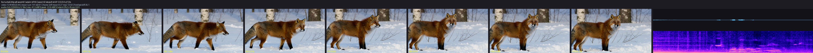

**Fox, seed 43** ([clip](assets/minimax-h3/fox_turbo544_q8_seed43.mp4)): a different fox and
framing from the same prompt, walking out of the birch shadows into the low sun and breaking into a
run at the end; a quiet track (-43 dBFS RMS) with the paw crunches and piano notes spaced along it.

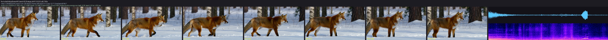

**Turbo versus base, seed 42** ([base clip](assets/minimax-h3/fox_base544_q8_seed42.mp4)): the same
prompt and seed through the 8-step 544p adapter (top, 17 min in a long-running process) and the
50-step base schedule at the same canvas (bottom, 62 min). Both stage the prompt: the fox approaches
down the forest path, pauses facing the camera, then bounds forward through the powder. The base
schedule keeps the fox smaller and deeper in the birch shadows with steadier motion and a similarly
quiet track (-44 dBFS RMS); the adapter frames it closer and brighter. The base entry remains the
reference schedule for the 768p canvas it was released with; for 544p iteration the adapter is the
faster choice at comparable fidelity.

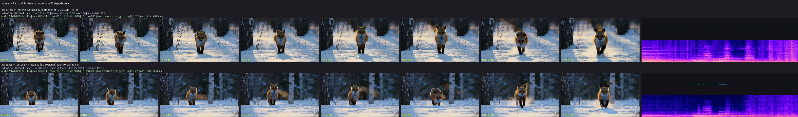

**Fox image-to-video, seed 42** ([clip](assets/minimax-h3/fox_i2v_turbo544_q8_seed42.mp4),
[keyframe](assets/minimax-h3/keyframe_fox.png), [prompt](assets/minimax-h3/prompt_fox_i2v.txt)):
the first frame of the 768p fox clip as keyframe through `minimax-h3-turbo-544p`. Frame 0 reproduces
the keyframe at PSNR 32.3 dB, the fox then looks at the camera and trots to the right with the camera
following, and the quiet track (-26.9 dBFS RMS) carries the paw crunches under the sparse piano the
prompt asks for; 14.8 min for 8 steps and both decodes in a long-running process, 86 GB MLX peak. The
sheet's first tile is the keyframe.

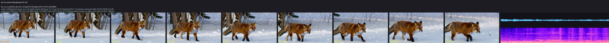

**Starship image-to-video, seed 42** ([clip](assets/minimax-h3/starship_i2v_turbo544_q8_seed42.mp4),
[keyframe](assets/examples/spaceship-snow/01_t2i_spaceship_snow.png),
[prompt](assets/minimax-h3/prompt_starship_i2v.txt)): the repository's `768x432` spaceship-on-snow
image on the 544p entry's native `960x544` canvas. Frame 0 reproduces the keyframe at PSNR 29.4 dB;
the hull, the two side engine pods, the red antenna and the landing legs stay intact while the
engines light up, a ring of ice dust spreads under the hull, the craft rises straight out of the top
of the frame and the dust settles on the empty plain. The track is a continuous low engine roar
(more than 80% of its energy below 200 Hz in every half second, -10.8 dBFS RMS) that builds with the
liftoff and fades as the craft leaves. 15.5 min for 8 steps and both decodes in a long-running
process (10.8 min in a fresh one).

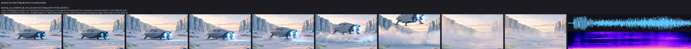

**Spaceship takeoff image-to-video, seed 42** ([clip](assets/minimax-h3/takeoff_i2v_turbo544_q8_seed42.mp4),
[keyframe](assets/i2v_takeoff_source.png), [prompt](assets/minimax-h3/prompt_takeoff_i2v.txt)): the
repository's square `512x512` cargo-ship image gives a `544x544` canvas on the 544p entry. The ship
keeps its shape and landing struts, lifts off in one continuous motion with a snow ring beneath it,
leaves through the top of the frame and the blown snow settles on the empty field; the engine
rumble builds from -21 to -14 dBFS RMS and fades with the climb, and the motion/audio-energy
correlation peaks at 0.71. 5.8 min for 8 steps and both decodes. Frame 0 matches the stretched
keyframe at PSNR 26.5 dB (the source carries film grain).

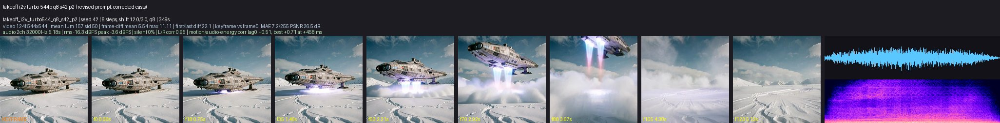

The same keyframe, prompt and seed through `minimax-h3-turbo` ([clip](assets/minimax-h3/takeoff_i2v_turbo768_q8_seed42.mp4))
lands on a `768x768` canvas: the same continuous liftoff with sharper hull plating, portholes and
struts (frame 0 at PSNR 29.3 dB), a -19 dBFS RMS engine track, 17.3 min for 8 steps and both
decodes, 88 GB process footprint.

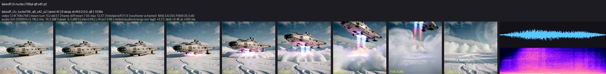

**Room walkthrough image-to-video, seed 42** ([clip](assets/minimax-h3/room_i2v_turbo544_q8_seed42.mp4),
[keyframe](assets/minimax-h3/keyframe_room.png), [prompt](assets/minimax-h3/prompt_room_i2v.txt)): a
first-person prompt on a `880x1168` watercolor painting of a living room, which the 544p entry maps to
a portrait `544x736` canvas. The camera walks across the rug toward the leather couch, lowers as it
sits, a hand reaches out and opens the nearest laptop until its screen faces us, and the view turns to
the bay windows, the round table and the trees outside, all in the painting's style. The park track
stays quiet until birdsong takes over in the second half (1 to 8 kHz carrying up to 75% of the energy)
with a lid click on top; the motion/audio-energy correlation peaks at 0.42. Frame 0 matches the
downscaled keyframe at PSNR 24.8 dB; 10.2 min for 8 steps and both decodes, 88 GB footprint. Fast
object manipulation is where the 8-step adapter is weakest: a handled object can settle into a new
orientation over a few frames instead of rotating continuously through them, so name the pivot and
anchor the object as the prompt above does.

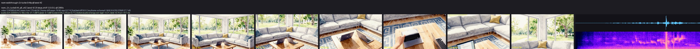

**Ocean waves, seed 42** ([clip](assets/minimax-h3/ocean_turbo544_q8_seed42.mp4),
[prompt](assets/minimax-h3/prompt_ocean.txt)): waves break over basalt rocks with a large spray
mid-clip while sea birds cross the sky; the broadband ocean track (-29.5 dBFS RMS) swells with the
break.

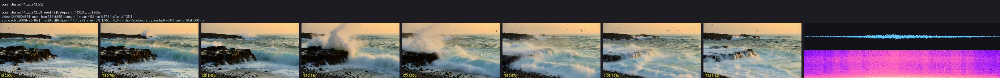

**Spoken dialogue, seed 42** ([clip](assets/minimax-h3/speech_turbo544_q8_seed42.mp4),
[prompt](assets/minimax-h3/prompt_speech.txt)): one speaker written as
`The woman with a clear, warm mid-pitched voice (S1) says: <d>[English] ...</d>` in the description,
with the kitchen ambience in the soundscape and no score. The model animates her mouth through the
line and generates the voice: the track is dominated by the 300 Hz to 3 kHz speech band in syllabic
bursts, its voiced pitch sits at a 219 Hz median, and the mouth region's motion follows the audio
envelope at a 0.54 correlation. Dialogue is generated speech, not a voice you supply; voice-timbre
references belong to the unported reference-to-video route.

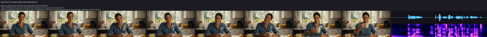

**Fox at 768p, seed 42** ([clip](assets/minimax-h3/fox_turbo768_q8_seed42.mp4)): the same prompt
through `minimax-h3-turbo` on its native `1344x768` canvas (8 steps, 34 min). Denser fur and snow
detail than the 544p clips, the same walk-then-look-at-camera staging, and a quiet stereo track with
the paw crunches tracking the motion.

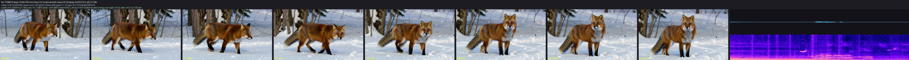

**Wan2.2 TI2V-5B on the fox description** ([clip](assets/minimax-h3/fox_wan_ti2v5b_q8_seed42.mp4)):
the visual part of the same prompt through the silent Wan route (`832x480`, 121 frames, 50 steps,
23 min). Included as a reference point for pacing and style, not as a like-for-like quality
comparison: the two models have different canvases, schedules, and training data, and only MiniMax-H3
generates the soundtrack.

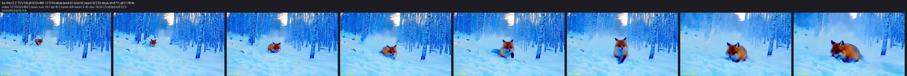

**Street guitarist, seed 42** ([clip](assets/minimax-h3/guitar_turbo544_q8_seed42.mp4),
[prompt](assets/minimax-h3/prompt_guitar.txt)): a slow dolly-in on a fingerpicking musician; the
spectrogram shows the plucked-string harmonics and rhythm of the on-camera guitar (-14 dBFS RMS,
stereo correlation 0.88).

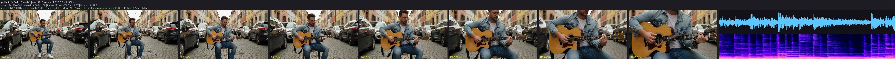
