# Quantization

MLX-Gen can run supported base Hugging Face models after `mlxgen download`. For lower-memory or
faster-loading variants, `mlxgen prepare --model ... --path ... --quantize ...` creates a local
MLX-Gen model package with the mflux/MLX saved-weight layout. Published AbstractFramework quantized
repos are these MLX-Gen-specific packages, often with model-specific choices such as keeping
sensitive layers in 8-bit or BF16. They are designed for MLX-Gen and are not Diffusers or
Transformers `from_pretrained()` checkpoints.

## Compatibility Summary

The current quantized-model compatibility surface is:

| Model family | q8 MLX-Gen packages | q4 MLX-Gen packages | Notes |
| --- | --- | --- | --- |
| Qwen Image | Supported | Supported with mixed q4/q8 | Applies to Qwen Image and Qwen Image 2512 text-to-image checkpoints. |
| Qwen Image Edit | Supported | Supported with mixed q4/q8 | Applies to the original Qwen Image Edit plus the 2509 and 2511 checkpoints. The original checkpoint routes single-image edit-reference only; 2509 and 2511 also route multi-reference. Validation reports record exact pass/fail quality evidence per package. |
| ERNIE Image Turbo | Supported | Supported with mixed q4/q8 | Text-to-image plus single-image latent image-to-image. Prompt Enhancer is optional and requires a full source snapshot. |
| FLUX.2 Klein | Supported | Supported | Standard MLX quantization policy. 9B derivatives follow the source gated/non-commercial access requirements. |
| Bonsai Image | Not an MLX-Gen q8 package | Ternary 2-bit pre-packed checkpoint supported | Bonsai checkpoints are already packed MLX artifacts. Use `mlxgen download` and `mlxgen generate`; do not run `prepare`. Binary 1-bit is detected but blocked until stock MLX supports 1-bit packed affine matmul. |
| Z-Image / Z-Image Turbo | Supported | Supported | Standard MLX quantization policy with model-specific generation defaults. |
| FIBO | Supported with mixed q8/BF16 when source access is available | Supported with mixed q4/BF16 when source access is available | Base FIBO text-to-image only. FIBO Edit is a separate model family and is not exposed as a public unified generation capability in this release. |
| SeedVR2 3B/7B | Supported | Supported | Image super-resolution through `mlxgen upscale`. Published q8/q4 packages are generated from the official `ByteDance-Seed/SeedVR2-3B` and `ByteDance-Seed/SeedVR2-7B` source models. |
| Wan2.2 | Supported with mixed q8/BF16 | Not published | MLX-Gen keeps Wan conditioning/output projection linears BF16 and quantizes the bulky transformer block linears at q8. |

MLX-Gen treats low-bit quality as model-specific, not automatic. Qwen and ERNIE use mixed q4/q8 policies to preserve generation quality. FIBO uses mixed q8/BF16 and q4/BF16 policies that keep precision-sensitive conditioning and output paths at BF16. Bonsai uses Prism's pre-packed ternary 2-bit transformer plus a 4-bit Qwen3 text encoder rather than MLX-Gen's `prepare` flow. q8 remains the closest optimized-package option to BF16 when memory allows.

For image and video generation, the default optimized recommendation in MLX-Gen is still the
validated q8 package when one exists. That is different from third-party FP8 checkpoint guidance.
For example, the upstream LightX2V Qwen Lightning README warns that BF16-trained Lightning LoRAs do
not automatically behave well on every external FP8 Qwen base. That warning does not map 1:1 to
MLX-Gen's published q8 packages. In MLX-Gen, prefer the documented q8 route plus the exact
validated Lightning adapter example for that route, and do not treat an arbitrary external FP8
checkpoint as equivalent to an `AbstractFramework/*-8bit` package.

The difference between Bonsai ternary 2-bit and MLX-Gen's mixed q4/q8 policies is mostly packaging and runtime ownership, not the quality philosophy. Both avoid blind full low-bit conversion:

| Strategy | Used by | Quality-preserving rule | Representative footprint and runtime |
| --- | --- | --- | --- |
| Mixed q4/q8 MLX-Gen packages | Qwen Image/Edit and ERNIE Image Turbo q4 packages created by `mlxgen prepare` | q4 for bulk transformer paths, q8 for empirically sensitive linears, BF16 for non-quantizable weights and selected runtime components. | ERNIE mixed q4/q8: 8.2 GiB package, 9.34 GiB peak RSS, 7.83 s at 512px. Qwen uses the same policy shape on larger source models. |
| Mixed q4/BF16 and q8/BF16 MLX-Gen packages | Base FIBO text-to-image packages created by `mlxgen prepare` | q4 or q8 for quantizable transformer/text-encoder linears, BF16 for the VAE and precision-sensitive FIBO conditioning, timestep, caption-projection, norm, and output paths. | FIBO q8/BF16: 14.5 GiB package, 15.89 GB max RSS, 16.45 s at 512px. FIBO q4/BF16: 10.2 GiB package, 11.39 GB max RSS, 15.24 s at 512px. |
| SeedVR2 q4/q8 MLX-Gen packages | SeedVR2 3B and 7B image super-resolution packages created by `mlxgen prepare` | q4 or q8 for quantizable SeedVR2 transformer linears and VAE attention linears, BF16 for convolutions, norms, and other non-quantizable parameters. | 3B q8: 4.39 GiB package, 4.73 GiB max RSS. 3B q4: 2.54 GiB package, 2.89 GiB max RSS. 7B q8: 8.62 GiB package, 8.90 GiB max RSS. 7B q4: 4.79 GiB package, 5.10 GiB max RSS. |
| Pre-packed ternary 2-bit checkpoint | Bonsai Image 2-bit from Prism | The transformer is already packed at 2-bit, the Qwen3 text encoder is 4-bit, and the Flux2 VAE stays BF16. | Bonsai ternary: 3.6 GiB cached snapshot, 3.57 GiB peak RSS, 2.92 s at 512px. |

These are not model-quality rankings across unrelated models. They show the current MLX-Gen rule: use the smallest validated layout that still stays in the same visual family as a higher-precision baseline.

## Published Package Matrix

MLX-Gen optimized packages published by the
[AbstractFramework Hugging Face organization](https://huggingface.co/AbstractFramework) should be
read together with the task resolver: public tasks describe media direction, while the selected
model determines the exact internal mode. Sizes below are current Hugging Face repository totals
checked on 2026-06-04 and rounded to one decimal GiB. Source size is the upstream repository total;
package size is the published AbstractFramework repository total.

### Text-To-Image And Latent Image-To-Image

| Source model | Public task / mode | Source size | Published packages | Package sizes | Quantization status |
| --- | --- | ---: | --- | ---: | --- |
| FLUX.2 Klein 4B | T2I, edit/reference I2I where supported by the model route | 22.1 GiB | `flux.2-klein-4b-4bit`<br>`flux.2-klein-4b-8bit` | 4.3 GiB<br>8.0 GiB | Standard MLX q4/q8 optimized packages. Distilled source/q8/q4 passed the June 5 edit-capability profile and the June 8 reframe profile; their June 8 outpaint rows are now stale historical evidence only. |
| FLUX.2 Klein 9B | T2I, edit/reference I2I where supported by the model route | 49.3 GiB | `flux.2-klein-9b-4bit`<br>`flux.2-klein-9b-8bit` | 8.9 GiB<br>16.6 GiB | Standard MLX q4/q8 optimized packages; inherits the source model's gated/non-commercial terms. Distilled source/q8/q4 passed the June 5 edit-capability profile and the June 8 reframe profile; their June 8 outpaint rows are stale historical evidence only. |
| FLUX.2 Klein Base 4B | T2I, edit/reference I2I where supported by the model route | 22.1 GiB | `flux.2-klein-base-4b-4bit`<br>`flux.2-klein-base-4b-8bit` | 4.3 GiB<br>8.0 GiB | Standard MLX q4/q8 optimized packages. Current published proof covers the source model on the June 10 starship profile; prepared base q8/q4 package proof is still pending. |
| FLUX.2 Klein Base 9B | T2I, edit/reference I2I where supported by the model route | 49.3 GiB | `flux.2-klein-base-9b-4bit`<br>`flux.2-klein-base-9b-8bit` | 8.9 GiB<br>16.6 GiB | Standard MLX q4/q8 optimized packages; inherits the source model's gated/non-commercial terms. Current published proof covers the source model on the June 10 starship profile; prepared base q8/q4 package proof is still pending. |
| Qwen Image | T2I | 53.7 GiB | `qwen-image-4bit`<br>`qwen-image-8bit` | 16.2 GiB<br>27.5 GiB | q4 uses MLX-Gen's mixed q4/q8 Qwen policy; q8 uses the standard q8 path. |
| Qwen Image 2512 | T2I | 53.7 GiB | `qwen-image-2512-4bit`<br>`qwen-image-2512-8bit` | 16.2 GiB<br>27.5 GiB | q4 uses MLX-Gen's mixed q4/q8 Qwen policy; q8 uses the standard q8 path. |
| ERNIE Image Turbo | T2I, latent I2I | 29.5 GiB | `ernie-image-turbo-8bit`<br>`ernie-image-turbo-4bit` | 11.5 GiB<br>11.5 GiB | The public `-8bit` package is q8. The public `-4bit` repository currently has q8 metadata and the same size as `-8bit`; do not treat it as a valid q4 memory package until it is republished. |
| Z-Image | T2I | 19.1 GiB | `z-image-4bit`<br>`z-image-8bit` | 5.5 GiB<br>10.2 GiB | Standard MLX q4/q8 optimized packages. |
| Z-Image Turbo | T2I | 30.6 GiB | `z-image-turbo-4bit`<br>`z-image-turbo-8bit` | 5.5 GiB<br>10.2 GiB | Standard MLX q4/q8 optimized packages. |
| FIBO | T2I | 23.8 GiB | `fibo-4bit`<br>`fibo-8bit` | 10.2 GiB<br>14.5 GiB | q8 uses mixed q8/BF16; q4 uses mixed q4/BF16. FIBO Edit is not included in these base FIBO packages. |

### Edit-Conditioned Image-To-Image

| Source model | Public task / mode | Source size | Published packages | Package sizes | Quantization status |
| --- | --- | ---: | --- | ---: | --- |
| Qwen Image Edit | I2I edit/reference | 53.8 GiB | `qwen-image-edit-4bit`<br>`qwen-image-edit-8bit` | 17.0 GiB<br>28.3 GiB | q4 uses MLX-Gen's mixed q4/q8 Qwen edit policy; q8 uses the standard q8 path. The original Qwen Image Edit checkpoint is single-reference; use the explicit 2509 or 2511 checkpoints for multi-reference routes. Source/q8/q4 passed the 2026-06-08 reframe/outpaint profile. |
| Qwen Image Edit 2509 | I2I edit/reference and multi-reference | 53.8 GiB | `qwen-image-edit-2509-4bit`<br>`qwen-image-edit-2509-8bit` | 17.0 GiB<br>28.3 GiB | q4 uses MLX-Gen's mixed q4/q8 Qwen edit policy; q8 uses the standard q8 path. The 2026-06-05 source and q8 validation passed the B/C/D/E spaceship edit sequence. The q4 package passed single-image B/C/D rows, but its multi-reference composition only partially applied the color reference. Source/q8/q4 passed the 2026-06-08 reframe/outpaint profile. |
| Qwen Image Edit 2511 | I2I edit/reference and multi-reference | 53.8 GiB | `qwen-image-edit-2511-4bit`<br>`qwen-image-edit-2511-8bit` | 17.0 GiB<br>28.3 GiB | q4 uses MLX-Gen's mixed q4/q8 Qwen edit policy; q8 uses the standard q8 path. Source, q8, and q4 passed the 2026-06-06 pencil sketch, hard-landing edit, multi-reference composition profile, and the 2026-06-08 reframe/outpaint profile. |

### Image Upscaling

| Source model | Public task / mode | Source size | Published packages | Package sizes | Quantization status |
| --- | --- | ---: | --- | ---: | --- |
| SeedVR2 3B | Image super-resolution/restoration | 13.57 GiB generation files | `seedvr2-3b-4bit`<br>`seedvr2-3b-8bit` | 2.54 GiB<br>4.39 GiB | Published q4/q8 packages generated from the official `ByteDance-Seed/SeedVR2-3B` checkpoint. Use through `mlxgen upscale`, not `mlxgen generate`. |
| SeedVR2 7B | Image super-resolution/restoration | 31.63 GiB generation files | `seedvr2-7b-4bit`<br>`seedvr2-7b-8bit` | 4.79 GiB<br>8.62 GiB | q4/q8 packages generated from the official regular `ByteDance-Seed/SeedVR2-7B` checkpoint. Use through `mlxgen upscale`, not `mlxgen generate`. |

### Text-To-Video And Image-To-Video

| Source model | Public task / mode | Source size | Published packages | Package sizes | Quantization status |
| --- | --- | ---: | --- | ---: | --- |
| Wan2.2 TI2V-5B | T2V and first-frame I2V | 31.9 GiB | `wan2.2-ti2v-5b-diffusers-bf16`<br>`wan2.2-ti2v-5b-diffusers-8bit` | 21.2 GiB<br>16.9 GiB | BF16 package plus q8/BF16 package. BF16 reduces storage/download size versus the FP32/BF16 source snapshot but does not reduce measured runtime memory. q8 further reduces storage and MLX model/allocator footprint in the documented 1280x704 benchmark. No q4 or mixed q4/q8 package is published. |
| Wan2.2 T2V-A14B | T2V | 117.5 GiB | `wan2.2-t2v-a14b-diffusers-bf16`<br>`wan2.2-t2v-a14b-diffusers-8bit` | 64.1 GiB<br>39.5 GiB | BF16 package plus mixed q8/BF16 package. Runtime measurements are below. |
| Wan2.2 I2V-A14B | I2V | 117.5 GiB | `wan2.2-i2v-a14b-diffusers-bf16`<br>`wan2.2-i2v-a14b-diffusers-8bit` | 64.1 GiB<br>39.5 GiB | BF16 package plus mixed q8/BF16 package. Runtime measurements are below. |

Runtime memory and timing measurements are currently complete in this document for SeedVR2 3B/7B,
ERNIE Image Turbo, Bonsai Image, Wan TI2V-5B, and Wan A14B benchmark profiles. Other published
packages are documented here by package size and quantization policy, with representative visual
panels where local benchmark runs have produced them.

## Reframe And Outpaint Package Validation

The 2026-06-08 reframe/outpaint profile validates source, q8, and q4 rows for Qwen Image Edit,
Qwen Image Edit 2509/2511, and distilled FLUX.2 Klein 4B/9B. For FLUX, treat the outpaint rows in
that profile as stale historical evidence only; current strict FLUX outpaint is base-only.


Inspect the machine-readable records for a package:

```sh
mlxgen validation \
  --profile reframe_outpaint_2026_06_08 \
  --model AbstractFramework/qwen-image-edit-2511-8bit
```

The exact commands and per-family contact sheets are listed in
[Reframe and Outpaint](reframe-outpaint.md).

Current base-model FLUX proof is published separately as source-model evidence only:

- [FLUX.2 Klein base 4B/9B edit matrix](assets/validation/flux2-klein-base-starship-2026-06-10/flux2-klein-base-starship-edit-matrix.jpg)
- [FLUX.2 Klein base 4B/9B strict-outpaint seam review](assets/validation/flux2-klein-base-starship-2026-06-10/flux2-klein-base-starship-outpaint-seams.jpg)

Prepared base q8/q4 packages expose the same route surface through `mlxgen capabilities`, but they
are not yet part of a published starship contact-sheet proof set.

## Qwen q4

Qwen Image and Qwen Image Edit use a mixed q4/q8 policy when created with `--quantize 4`. Fully q4 Qwen checkpoints can lose coherent generative behavior, so MLX-Gen keeps only the sensitive paths at higher precision:

- q4 for most Qwen transformer attention, feed-forward, and projection linears.
- q8 for Qwen `*.img_mod_linear` transformer modulation layers.
- q4 for group64-compatible Qwen text-encoder language linears.
- q8 for group64-compatible Qwen text-encoder visual linears.
- BF16 for the VAE, norms, embeddings, and linears that are not MLX group64-compatible.

This policy applies to Qwen q4 MLX-Gen packages only. It is used for Qwen Image and Qwen Image Edit variants, including 2509 and 2511 edit checkpoints.

Representative Qwen Image 2512 512x512 benchmark at 15 steps:

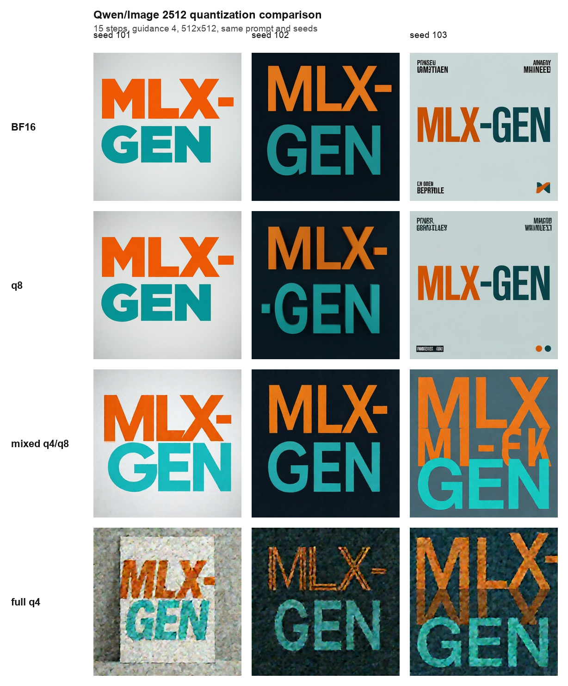

## FIBO q8 And q4

Base FIBO supports text-to-image MLX-Gen packages when the user has access to the gated
`briaai/FIBO` source model:

```bash
mlxgen prepare --model briaai/FIBO --path models/fibo-8bit -q 8
mlxgen prepare --model briaai/FIBO --path models/fibo-4bit -q 4
```

FIBO q8 uses a mixed q8/BF16 policy, and FIBO q4 uses a mixed q4/BF16 policy:

- q8 or q4 for quantizable FIBO transformer and text-encoder linears.
- BF16 for the FIBO VAE.
- BF16 for FIBO conditioning, timestep, caption-projection, normalization, and output-projection
  paths that are precision-sensitive in MLX-Gen.

The 512x512 benchmark below used the same JSON prompt, seed 103, 8 denoise steps, and guidance 5.
The q8/BF16 package stayed close to the source result; the q4/BF16 package remained coherent but
shows more drift on fine text.

| Package | Disk | Time | Max RSS | MAE vs source |
| --- | ---: | ---: | ---: | ---: |
| Source `briaai/FIBO` | 23.8 GiB cache | 15.13 s | 24.13 GB | baseline |
| `AbstractFramework/fibo-8bit` | 14.5 GiB | 16.45 s | 15.89 GB | 8.81 |
| `AbstractFramework/fibo-4bit` | 10.2 GiB | 15.24 s | 11.39 GB | 17.56 |

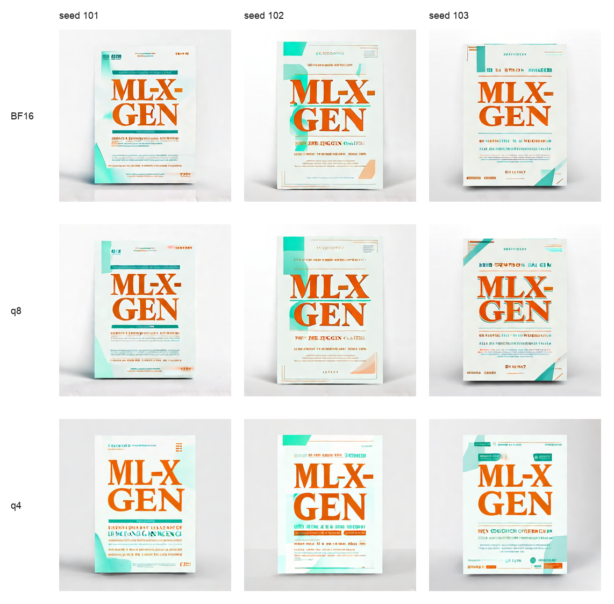

## SeedVR2 q8 And q4

SeedVR2 3B image super-resolution can run from the official source model or from reusable
published MLX-Gen q8/q4 packages:

```sh
mlxgen download --model AbstractFramework/seedvr2-3b-8bit

mlxgen upscale \
  --model AbstractFramework/seedvr2-3b-8bit \
  --image-path input.png \
  --resolution 2x \
  --seed 42 \
  --metadata \
  --output input_seedvr2_q8_2x.png
```

The q8 and q4 packages quantize SeedVR2 transformer linears and VAE attention linears where MLX
supports it. Convolutions, normalization layers, and other non-quantizable parameters remain BF16.

The table below was measured on an Apple M5 Max with 128 GB unified memory. Each row used the same
`133x113` source image, `--resolution 5x`, seed 42, and metadata output. The final image size was
`658x560`.

| Package | Storage | Generation time | Wall time | Max RSS | Output |
| --- | ---: | ---: | ---: | ---: | --- |
| `ByteDance-Seed/SeedVR2-3B` source generation files | 13.57 GiB | 2.27 s | 5.89 s | 25.49 GiB | [PNG](assets/upscaling/seedvr2-3b-official-base-5x.png) |
| `AbstractFramework/seedvr2-3b-8bit` | 4.39 GiB | 2.13 s | 3.22 s | 4.73 GiB | [PNG](assets/upscaling/seedvr2-3b-q8-5x.png) |
| `AbstractFramework/seedvr2-3b-4bit` | 2.54 GiB | 2.16 s | 3.18 s | 2.89 GiB | [PNG](assets/upscaling/seedvr2-3b-q4-5x.png) |

`Generation time` is the model-reported generation duration. `Wall time` and `Max RSS` come from
`/usr/bin/time -l` around the complete command. The source row includes loading the official
PyTorch checkpoint files. The q8/q4 package rows load MLX-Gen saved weights directly.

SeedVR2 7B uses the official `ByteDance-Seed/SeedVR2-7B` source model and has q8/q4 MLX-Gen
packages:

```sh
mlxgen download --model AbstractFramework/seedvr2-7b-8bit

mlxgen upscale \
  --model AbstractFramework/seedvr2-7b-8bit \
  --image-path input.png \
  --resolution 2x \
  --seed 42 \
  --metadata \
  --output input_seedvr2_7b_q8_2x.png
```

The official 7B repository also contains a `seedvr2_ema_7b_sharp.pth` checkpoint. The MLX-Gen
`seedvr2-7b` route documented here uses the regular `seedvr2_ema_7b.pth` checkpoint.

| Package | Storage | Generation time | Wall time | Max RSS | Output |
| --- | ---: | ---: | ---: | ---: | --- |
| `ByteDance-Seed/SeedVR2-7B` source generation files | 31.63 GiB | 2.64 s | 8.69 s | 61.62 GiB | [PNG](assets/upscaling/seedvr2-7b-official-base-5x.png) |
| `AbstractFramework/seedvr2-7b-8bit` | 8.62 GiB | 2.29 s | 3.36 s | 8.90 GiB | [PNG](assets/upscaling/seedvr2-7b-q8-5x.png) |
| `AbstractFramework/seedvr2-7b-4bit` | 4.79 GiB | 2.21 s | 3.24 s | 5.10 GiB | [PNG](assets/upscaling/seedvr2-7b-q4-5x.png) |

The combined sheet below stacks the 3B and 7B results from the same source image and `5x` profile:

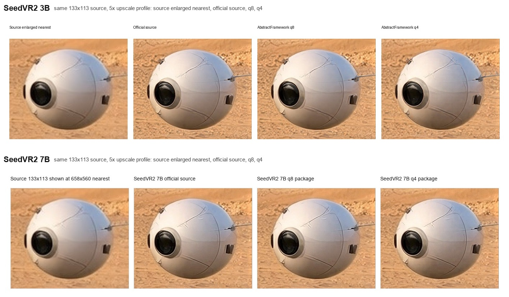

## q8

Qwen q8 uses the standard MLX-Gen/mflux quantization flow: quantizable modules are saved at 8-bit where the model layout supports MLX quantization, while VAE weights and non-quantizable layers remain BF16.

Other model families use their existing model-specific quantization predicates.

## Wan q8

Wan q8 uses a mixed q8/BF16 policy. MLX-Gen quantizes the bulky transformer block linears and keeps
sensitive paths at BF16:

- q8 for quantizable Wan transformer attention and feed-forward linears.
- BF16 for the Wan VAE.
- BF16 for Wan transformer `condition_embedder.*` and `proj_out`.
- BF16 for the UMT5 text encoder, scheduler metadata, tokenizer files, norms, convolutions, and
  other non-quantizable parameters.

The published TI2V-5B MLX-Gen packages are
`AbstractFramework/wan2.2-ti2v-5b-diffusers-bf16` and
`AbstractFramework/wan2.2-ti2v-5b-diffusers-8bit`. The upstream TI2V-5B source snapshot is about
31.9 GiB and is not uniformly 16-bit on disk: its transformer and VAE safetensors are FP32, while
the UMT5 text encoder is BF16. MLX-Gen loads Wan transformer/VAE weights at BF16 runtime precision,
so the 21.2 GiB BF16 package is a storage and download-size optimization, not a runtime
memory optimization. The q8 package is 16.9 GiB and reduces stored model bytes plus the active MLX
model footprint. In the benchmark below, full-process `Physical Peak` is similar across source,
BF16 package, and q8/BF16 layouts. TI2V-5B q4 or mixed q4/q8 is not published as a supported
package.

TI2V-5B benchmark on an Apple M5 Max used the same prompt, seed, resolution, frame count, steps,
guidance, fps, and explicit empty negative prompt for the source model, BF16 package, and q8/BF16
package:

```sh
--prompt "A short cinematic video of a glowing orange glass sphere floating above calm teal water, soft reflections, gentle camera movement" \
--negative-prompt "" \
--width 1280 --height 704 --frames 17 --steps 20 --guidance 5 --fps 24 --seed 321
```

| Layout | Package | Storage | Wan MLX model | MLX active after generation | Physical Peak | Max RSS | MLX Peak | Time | Runtime profile | MP4 | Decoded-frame comparison |
| --- | --- | ---: | ---: | ---: | ---: | ---: | ---: | ---: | --- | --- | --- |
| Upstream source snapshot | `Wan-AI/Wan2.2-TI2V-5B-Diffusers` | 31.9 GiB | 10.6 GiB | 10.3 GiB | 102.7 GiB | 13.7 GiB | 58.5 GiB | 216.2 s | 1280x704, 17 frames, 20 steps, 24 fps, default cache | [base-source.mp4](assets/quantization/wan-ti2v5b-clean/base-source.mp4) | Baseline. |
| BF16 MLX-Gen package | `AbstractFramework/wan2.2-ti2v-5b-diffusers-bf16` | 21.2 GiB | 10.6 GiB | 10.3 GiB | 102.6 GiB | 14.5 GiB | 58.5 GiB | 261.6 s | Same profile | [bf16-package.mp4](assets/quantization/wan-ti2v5b-clean/bf16-package.mp4) | Byte-identical decoded frames versus source. |
| Mixed q8/BF16 MLX-Gen package | `AbstractFramework/wan2.2-ti2v-5b-diffusers-8bit` | 16.9 GiB | 6.3 GiB | 6.1 GiB | 103.7 GiB | 13.8 GiB | 54.2 GiB | 243.4 s | Same profile | [mixed-q8-bf16.mp4](assets/quantization/wan-ti2v5b-clean/mixed-q8-bf16.mp4) | Mean frame MAE 1.7 versus source/BF16. |

`Storage` is the Hugging Face repository total. `Wan MLX model` is the loaded Wan transformer plus
VAE tensor footprint measured from MLX arrays; it excludes the UMT5 text encoder, tokenizer, Python
objects, video buffers, and save validation. `MLX active after generation` is the MLX allocator
memory still live after `generate_video()` returns, before cleanup. `Physical Peak` is the sampled
Darwin full-process physical-footprint high-water mark from model initialization through MP4 save
and health validation; it includes MLX/Metal allocations, the PyTorch UMT5 prompt encoder, Python
and native-library transients, decoded video buffers, and save validation. `Max RSS` is resident set
high-water memory reported by the process tools; on Apple unified memory it can under-report Metal
and other physical-footprint allocations. `MLX Peak` is only the MLX allocator high-water mark and
does not include every process-level allocation.


Detailed frame metrics are available in
[metrics.json](assets/quantization/wan-ti2v5b-clean/metrics.json). Wan uses the model's official
negative prompt when `--negative-prompt` is omitted. This benchmark passes `--negative-prompt ""`
to run without the default negative prompt for a simple abstract object/water scene.

The upstream Wan A14B Diffusers source snapshots are about 117.5 GiB. MLX-Gen also publishes
BF16 MLX-Gen packages for users who want a smaller reusable MLX-Gen package without quantizing
runtime-sensitive weights.

The A14B benchmark table uses small repeatable low-RAM runs on an Apple M5 Max with 128 GiB unified
memory. Current CLI `--low-ram` clears cache between denoise steps, clears transformer-block
boundaries, releases inactive denoisers before decode, and clears cache during VAE temporal-slice
decode.

| Model | Package | Disk | Physical Peak | Max RSS | MLX Peak | Generation Time | Benchmark Profile | Metrics |
| --- | --- | ---: | ---: | ---: | ---: | ---: | --- | --- |
| Wan2.2 T2V-A14B | BF16 | 64.1 GiB | 33.0 GiB | 31.8 GiB | 27.7 GiB | 152.7 s | 384x224, 33 frames, 12 steps, 8 fps, low-RAM | [JSON](assets/quantization/wan-a14b-lowram/t2v_bf16_384x224_33f_12steps_seed4242.metrics.json) |
| Wan2.2 T2V-A14B | mixed q8/BF16 | 39.5 GiB | 20.7 GiB | 19.5 GiB | 15.5 GiB | 154.8 s | 384x224, 33 frames, 12 steps, 8 fps, low-RAM | [JSON](assets/quantization/wan-a14b-lowram/t2v_q8bf16_384x224_33f_12steps_seed4242.metrics.json) |
| Wan2.2 I2V-A14B | BF16 | 64.1 GiB | 33.7 GiB | 31.8 GiB | 28.2 GiB | 228.2 s | 384x384, 33 frames, 12 steps, 8 fps, low-RAM | [JSON](assets/quantization/wan-a14b-lowram/i2v_bf16_384x384_33f_12steps_seed4242.metrics.json) |
| Wan2.2 I2V-A14B | mixed q8/BF16 | 39.5 GiB | 21.5 GiB | 19.6 GiB | 15.9 GiB | 242.2 s | 384x384, 33 frames, 12 steps, 8 fps, low-RAM | [JSON](assets/quantization/wan-a14b-lowram/i2v_q8bf16_384x384_33f_12steps_seed4242.metrics.json) |

In these A14B low-RAM benchmarks, mixed q8/BF16 cuts disk usage by about 38% versus the
BF16 MLX-Gen packages and reduces full-process physical peak memory by about 36-37%. It is not
currently claimed as a speed improvement.

The 0.18.11 release also validated the published A14B q8 Hugging Face handles on a short practical
video profile. These runs use the default generation path, not `--low-ram`, and keep tensor-health
diagnostics opt-in. The I2V row uses a 16:9 source image and therefore resolves the 480x240 size
target to 448x256 to preserve the source aspect ratio.

| Model handle | Task | Requested size | Output size | Frames | Steps | Guidance | Time | Max RSS | Output |
| --- | --- | ---: | ---: | ---: | ---: | --- | ---: | ---: | --- |
| `AbstractFramework/wan2.2-t2v-a14b-diffusers-8bit` | T2V | 480x240 | 480x240 | 41 | 15 | 4 / 3 | 348.9 s | 19.5 GiB | [MP4](assets/quantization/wan-a14b-q8-release/t2v_a14b_q8_480x240_41f_15steps_seed4242.mp4), [metadata](assets/quantization/wan-a14b-q8-release/t2v_a14b_q8_480x240_41f_15steps_seed4242.metadata.json) |
| `AbstractFramework/wan2.2-i2v-a14b-diffusers-8bit` | I2V | 480x240 | 448x256 | 41 | 15 | 4 / 3 | 360.3 s | 19.6 GiB | [MP4](assets/quantization/wan-a14b-q8-release/i2v_a14b_q8_480x240_41f_15steps_seed4243.mp4), [metadata](assets/quantization/wan-a14b-q8-release/i2v_a14b_q8_480x240_41f_15steps_seed4243.metadata.json) |

The contact sheets below are extracted from the MP4 outputs linked in the table.

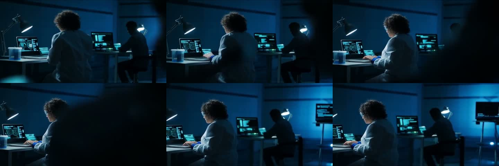


For longer `101`-frame, 20 fps Wan examples comparing A14B at `480x240` with TI2V-5B at
`832x480` and `1280x704`, see [Wan Video](wan-video.md).

Full-size Wan video memory and runtime vary with resolution, frame count, step count, task, cache
settings, and prompt/image conditioning. Measure the profile you plan to use before starting long
production jobs.

## ERNIE Image Turbo

ERNIE Image Turbo supports BF16, q8, and q4 text-to-image generation. Use `mlxgen prepare` to create reusable q8 or q4 MLX-Gen packages:

```sh
mlxgen prepare --model baidu/ERNIE-Image-Turbo --path ./models/ernie-image-turbo-8bit --quantize 8
mlxgen prepare --model baidu/ERNIE-Image-Turbo --path ./models/ernie-image-turbo-4bit --quantize 4
```

ERNIE q4 uses a model-specific mixed q4/q8 policy. Fully q4 ERNIE checkpoints can drift from BF16/q8 behavior, especially on text-heavy poster prompts, so MLX-Gen keeps the sensitive text-conditioning and attention-output paths at q8:

- q4 for ERNIE transformer Q/K attention projections.
- q4 for ERNIE transformer feed-forward modules.
- q8 for ERNIE transformer V/O attention projections.
- q8 for ERNIE text projection, timestep embedding, AdaLN modulation, final norm, and final projection.
- q8 for Mistral3 text-encoder and Prompt Enhancer linears.
- q8 for quantizable ERNIE VAE attention modules.
- BF16 for norms, convolutions, and other non-quantizable parameters.

Local benchmark on Apple Silicon with 512x512, 8 steps, guidance 1:

| Layout | Package Size | Peak RSS | Average Generation Time | Notes |
| --- | ---: | ---: | ---: | --- |
| BF16 source generation components | ~22.4 GiB | 23.5 GiB | 6.38 s | Fastest at 512px, largest memory footprint. |
| q8 MLX-Gen package | 12 GiB | 12.9 GiB | 7.57 s | About half the memory footprint. |
| full q4 exploratory layout | 6.2 GiB | 7.2 GiB | 9.31 s | Too much visual drift on controlled poster tests; not recommended. |
| mixed q4/q8 MLX-Gen package | 8.2 GiB | 9.34 GiB | 7.83 s | Default q4 policy; preserves BF16/q8 behavior more closely. |

At 1024x1024 with 8 steps and guidance 1, q8 generated in 84.69 s with 12.9 GiB peak RSS, and the older full-q4 exploratory layout generated in 78.94 s with 7.2 GiB peak RSS. The mixed q4/q8 default should be used for new ERNIE q4 packages because the full-q4 layout does not preserve quality reliably.

On a controlled 512x512 poster prompt with seed 123, q8 stayed close to BF16 while full q4 visibly changed text color and composition. Mean absolute pixel error against q8 was 26.00 for full q4 and 12.03 for mixed q4/q8. Across a 3-seed poster repeat, full q4 averaged 33.48 MAE against q8 while mixed q4/q8 averaged 16.39 MAE.

ERNIE q8/q4 MLX-Gen packages contain the ordinary text-to-image generation components. ERNIE Prompt Enhancer remains an optional full-source-snapshot feature and is not bundled into quantized MLX-Gen packages.

Representative ERNIE Image Turbo 512x512 benchmark panels:

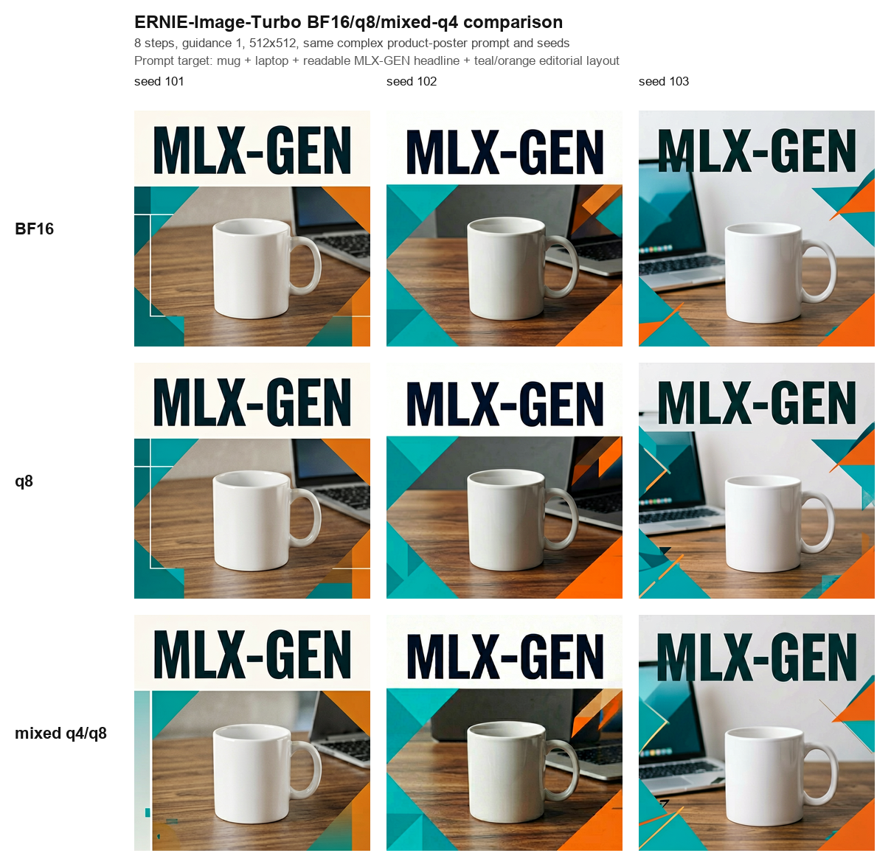

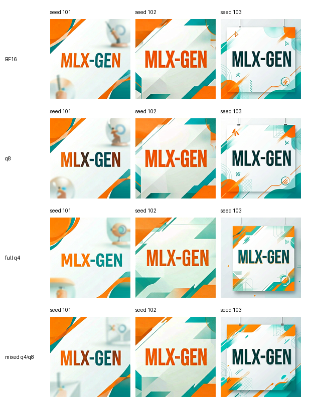

ERNIE Image Turbo also supports single-image image-to-image in MLX-Gen. The image path is encoded with the ERNIE VAE, patchified to the ERNIE denoising latent shape, normalized with the model's VAE batch-normalization statistics, and then blended with generation noise before denoising. This is an MLX-Gen extension; use it for stylization and guided variation rather than exact multi-image editing.

The same 512x512 image-to-image pencil-sketch prompt with seed 503 stayed coherent across BF16, q8, and mixed q4/q8:

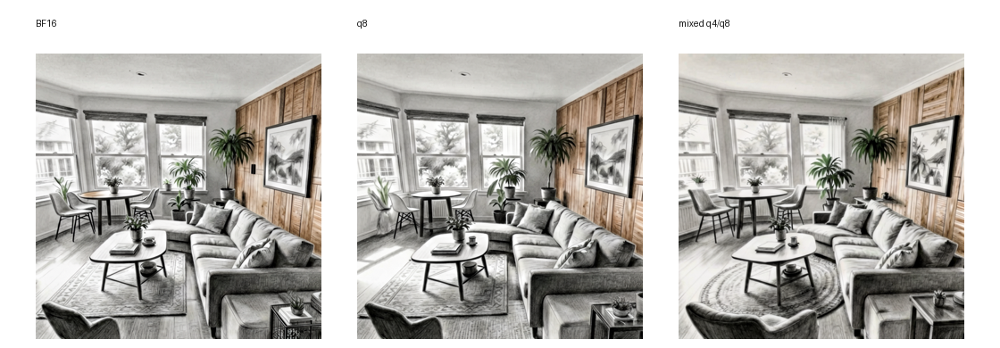

ERNIE image-to-image is not a substitute for a true edit-conditioned model. It initializes ERNIE's text-to-image denoising from encoded image latents, so it is useful for fast stylization and guided variation. Use Qwen Image Edit for one-image instruction edits when the source layout should remain active as conditioning, and use FLUX.2 when the workflow needs validated multi-reference composition. Use dimensions that match the source aspect ratio and consider 12-16 steps for stronger stylization.

Representative ERNIE q8 image-to-image versus Qwen Image Edit 2511 q4 comparisons:

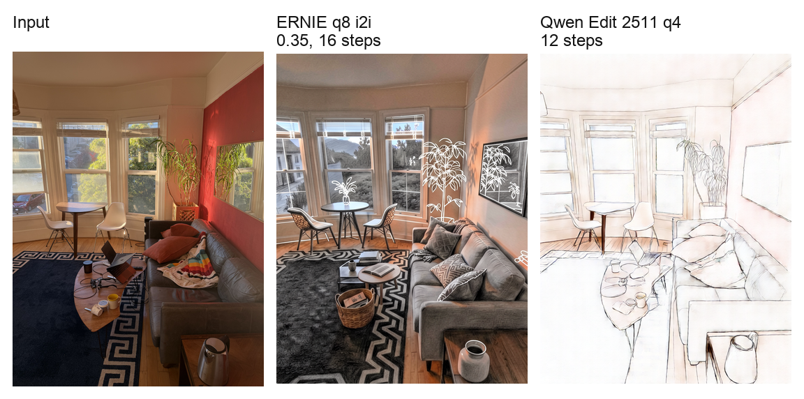

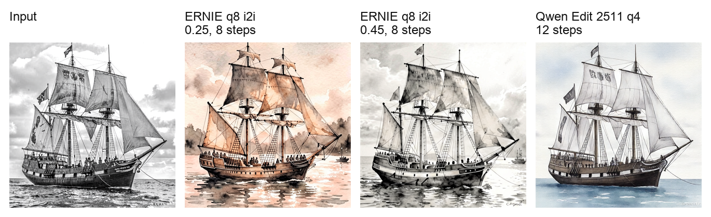

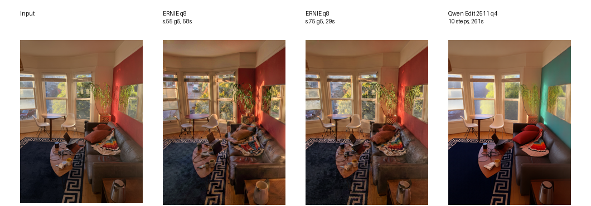

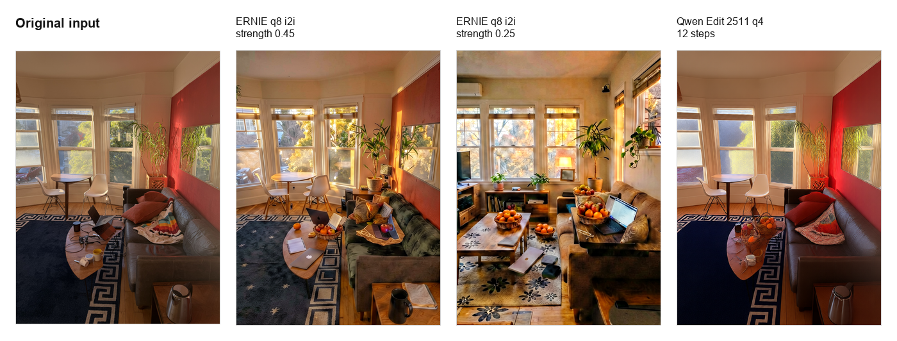

In the object-replacement comparison, ERNIE can introduce the requested fruit-basket concept, but it does so by reimagining the room from its encoded latent initialization. Qwen Image Edit keeps the source image active as conditioning throughout denoising and is therefore better suited to one-image layout-preserving instruction edits.

## Bonsai Image

Bonsai Image support is different from ordinary q4/q8 preparation. Prism publishes Bonsai as
ready-to-run MLX artifacts:

- `prism-ml/bonsai-image-ternary-4B-mlx-2bit`: supported in MLX-Gen.
- `prism-ml/bonsai-image-binary-4B-mlx-1bit`: detected, but not runnable on stock MLX through
  0.31.2 because the active runtime cannot execute the required `bits=1, group_size=128` packed
  affine matmul.

Use `mlxgen download` to cache Bonsai, then generate directly:

```sh
mlxgen download --model prism-ml/bonsai-image-ternary-4B-mlx-2bit

mlxgen generate \
  --model prism-ml/bonsai-image-ternary-4B-mlx-2bit \
  --prompt "A bonsai tree in a quiet ceramic studio, soft morning light" \
  --width 1024 \
  --height 1024 \
  --steps 4 \
  --guidance 1 \
  --seed 42 \
  --output bonsai.png
```

Do not use `mlxgen prepare` for Bonsai. The repository already contains a low-bit packed
transformer, a 4-bit Qwen3 text encoder, and a BF16 Flux2 VAE.

Local comparison against FLUX.2 Klein 4B q8 on the same prompt, seed 42, guidance 1, and 4 steps:

| Model | Disk footprint | 512px average time | 512px peak RSS | 1024px time | 1024px peak RSS | Notes |
| --- | ---: | ---: | ---: | ---: | ---: | --- |
| Bonsai ternary 2-bit | 3.6 GiB cached snapshot | 2.92 s | 3.57 GiB | 5.69 s | 3.60 GiB | Coherent image quality, same visual family as Klein 4B q8. |
| FLUX.2 Klein 4B q8 | 22 GiB source cache, q8 applied at runtime | 3.55 s | 9.23 GiB | 6.81 s | 9.39 GiB | Strong baseline with much higher memory footprint. |
| Bonsai binary 1-bit | 3.2 GiB cached snapshot | Not runnable | Not runnable | Not runnable | Not runnable | Waiting on stock-MLX 1-bit packed affine runtime support; latest checked stock MLX is 0.31.2. |

The 512px timing values are three cold-process repeats captured with `/usr/bin/time -l`. The Klein
baseline used on-the-fly q8 from the parent source cache because local disk space was tight during
validation.

Representative Bonsai ternary versus FLUX.2 Klein 4B q8 benchmark:


## Other Quantized Families

FLUX.2 Klein, Z-Image, and Z-Image Turbo currently use their standard model-specific MLX
quantization predicates. The following panels are representative checks, not a claim that every
prompt has identical visual behavior across quantization levels.

Z-Image 512x512 benchmark:

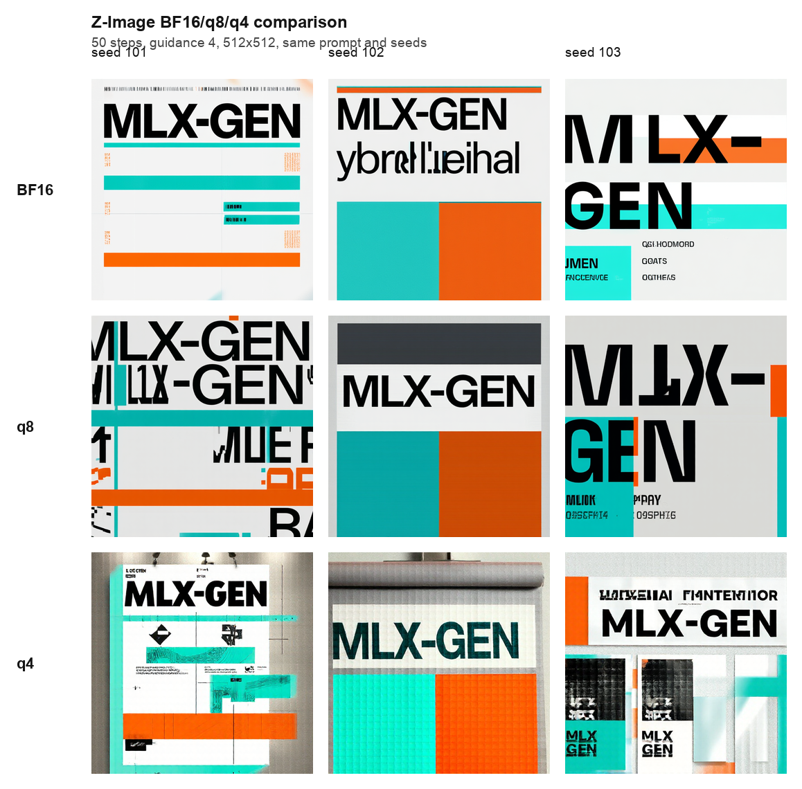

Z-Image Turbo 512x512 benchmark:

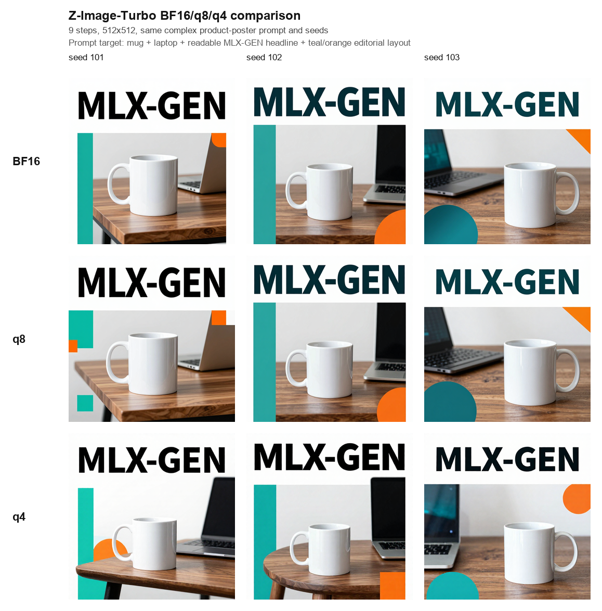

## Compatibility

Saved MLX-Gen packages can be loaded by MLX-Gen and by compatible mflux code that understands the same saved-weight layout and quantization predicates. They are not directly readable by Diffusers or Transformers because the files contain MLX quantization tensors and the mflux/MLX component layout.
