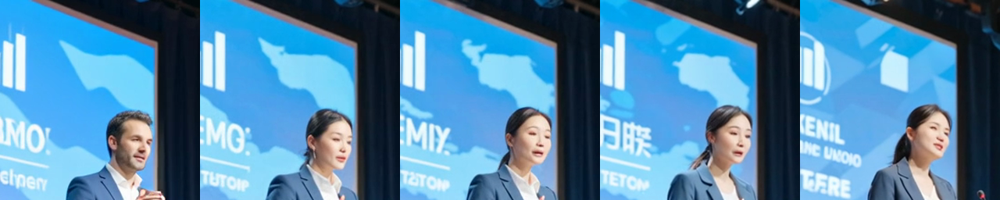

# Wan Video

MLX-Gen supports Wan2.2 text-to-video and image-to-video through `mlxgen generate`, plus
prompt-guided video-to-video on `Wan2.2-T2V-A14B` in plain form or with `--video-mask-path`. Use
this page for practical size, frame, and runtime guidance; use [API and CLI](api.md#wan-video) for
the full command surface.

## Current Practical Guidance

Wan A14B is the stronger local option in the measured starship example below when you can accept a
smaller canvas. On an Apple M5 Max, a 5.05 second clip at `480x240` or `240x480`, `101` frames,
`20` fps, and `20` to `25` steps takes about 30 minutes in the local profiles below. For the
specific starship prompt shown here, the documented A14B text-to-video result at `480x240` is the
preferred practical setting over TI2V-5B at `832x480`.

TI2V-5B remains useful as the smaller 5B route and supports both text-to-video and first-frame
image-to-video. It uses 32-pixel spatial multiples and is designed around `1280x704` or
`704x1280`; `832x480` is a practical lower-cost size. A `1280x704`, `25` step, `101` frame local
run takes about the same time as the A14B `480x240` profile in this page.
For TI2V-5B, treat smaller canvases below `832x480` as command and prompt-routing checks rather
than visual-quality settings.

Wan uses a flow-matching schedule shift. MLX-Gen uses the selected model's default unless you pass
`--flow-shift`: TI2V-5B defaults to `5.0` for native 720p-class runs, while A14B defaults to `3.0`.
For new 480p-class TI2V-5B checks such as `832x480`, use `--flow-shift 3`.

The public Wan video-to-video route stays intentionally narrow:

Plain video-to-video means one source clip plus one text prompt. MLX-Gen uses the source clip as a
composition anchor, then regenerates the video under the prompt. It is useful for broad
whole-scene or whole-subject changes while keeping the overall camera path. Be precise about what
survives: camera path, framing, and scene layout carry through at typical strengths, but subject
gestures and timing are re-synthesized - the model generates plausible motion, not the source's
exact motion. The measured motion-fidelity ladder below shows where that transition happens. For
exact preservation of a region (including its motion), use `--video-mask-path`.

### Motion Fidelity Versus Strength

`--video-strength` is not linear: the flow shift warps it, so the warm start keeps far less
source signal than the number suggests. Measured on a subject-swap edit (25 frames, 20 steps,
CFG on, one seed; gesture-timing correlation of the subject region's motion against the source,
where 1.0 = source motion and values below ~0.42 are statistically indistinguishable from
zero). The Lightning row comes from the paired 17-frame control clip, not the 25-frame ladder:

| `--video-strength` | Warm-start sigma (shift 3) | Source signal kept | Gesture timing r | What you get (in the measured runs) |
| --- | --- | --- | --- | --- |
| 0.5 | 0.75 | 25% | 0.86 | edit applied, source gestures preserved |
| 0.6 | 0.82 | 18% | 0.90 | edit applied, source gestures preserved |
| 0.7 | 0.88 | 12% | 0.73 | mostly preserved |
| 0.8 (default) | 0.92 | 8% | 0.20 | gestures re-synthesized |
| Lightning recipe (0.75 at shift 5) | 0.94 | 6% | -0.16 to 0.45 (prompt-dependent, paired control) | gestures re-synthesized |

Practical guidance from the ladder (proof bundle with commands, per-run metrics, and contact
sheets: [motion-ladder-2026-07-05](assets/validation/motion-ladder-2026-07-05/README.md)):

- For "keep the motion, change the look" restyles, use `--video-strength 0.5-0.6` at 20 steps
  with CFG on. Below 0.7 the A14B high-noise stage is skipped (`--guidance` is inert and a
  warning prints; `--guidance-2` carries the CFG on the low-noise expert) - fine for restyling,
  weaker for adding brand-new objects; use a mask for those.
- The 4-step Lightning fast path cannot reach the motion-preserving band: at 4 steps, strength
  0.5-0.65 leaves 2 effective steps and drops the high-noise LoRA entirely. Fast and
  motion-preserving are currently mutually exclusive; pick per clip.
- Prompt wording matters at high noise but cannot lock timing: in a paired control run at the
  Lightning point, adding "gesturing naturally with his hands" to the prompt restored gesturing
  where the same seed without it produced hands-on-podium - the class of motion returned, not
  the source's exact timing.

Motion-preserving restyle recipe (measured settings; adjust canvas, frames, and prompt to your
clip):

```sh
mlxgen generate \
  --model AbstractFramework/wan2.2-t2v-a14b-diffusers-8bit \
  --video-path source.mp4 \
  --prompt "Describe the restyled subject and what must stay the same" \
  --width 480 --height 832 --frames 25 --fps 16 \
  --steps 20 --guidance 4 --guidance-2 3 --video-strength 0.6 \
  --solver unipc --seed 8602 --low-ram --metadata \
  --output restyled.mp4
```

Expect the boundary-skip warning: below strength 0.7 the high-noise stage never runs, so
`--guidance 4` is inert and `--guidance-2 3` provides the classifier-free guidance.

The measured rows are published for inspection (the exact ladder commands are in the bundle
README; the strength-0.6 run below used the recipe above with the woman-swap prompt and its
custom negative prompt, seed 8602):

- strength 0.6 output (edit applied, gestures preserved, r 0.90): [ladder_s06.mp4](assets/validation/motion-ladder-2026-07-05/ladder_s06.mp4) + [metadata](assets/validation/motion-ladder-2026-07-05/ladder_s06.metadata.json)
- strength 0.8 output (gestures re-synthesized, r 0.20): [ladder_s08.mp4](assets/validation/motion-ladder-2026-07-05/ladder_s08.mp4) + [metadata](assets/validation/motion-ladder-2026-07-05/ladder_s08.metadata.json)
- paired prompt control at the Lightning point: [control_gesture_prompt.mp4](assets/validation/motion-ladder-2026-07-05/control_gesture_prompt.mp4) + [metadata](assets/validation/motion-ladder-2026-07-05/control_gesture_prompt.metadata.json)
- edit-success face crops (source, 0.5, 0.6, 0.7, 0.8):



Temporal and audio contract, in plain terms:

- MLX-Gen resamples the source onto the `--fps` timeline at decode, so the output keeps real-time
  speed regardless of the source frame rate: `--frames 17 --fps 16` always consumes the first
  1.06 s of the source. Downsampling (for example 30 fps -> 16 fps) drops intermediate frames and
  prints an informational note; upsampling above the source fps duplicates frames and prints a
  warning, because duplicated conditioning frames reduce motion smoothness. When source and
  requested fps already match, frames pass through untouched (bit-identical with earlier
  releases). Metadata records `source_video_fps` and `source_video_resampled`.
- When the source clip has an audio track, the matching audio segment is copied onto the saved
  output (trimmed to the output duration). The copy is best-effort: if it cannot be completed
  (for example, `ffmpeg` missing), the video is saved silent, a warning prints the reason plus a
  manual remux command, and metadata records `audio_copied` / `audio_copy_reason`. This is
  deliberately softer than the SeedVR2 restore contract, which fails on unpreserved audio: a
  failed mux must not discard a finished generation.

Included proof (a 30 fps source with an audio track, edited at `--fps 16`; the output keeps
real-time speed and carries the audio - play the MP4 to hear it):

- source (30 fps, 47 frames, 440 Hz tone): [conference_30fps_with_audio.mp4](assets/examples/conference-fps-audio/conference_30fps_with_audio.mp4)
- output (16 fps, 17 frames, AAC audio, red-necktie edit): [red_tie_fps_audio.mp4](assets/examples/conference-fps-audio/red_tie_fps_audio.mp4)
- run metadata (`source_video_resampled: true`, `audio_copied: true`): [red_tie_fps_audio.metadata.json](assets/examples/conference-fps-audio/red_tie_fps_audio.metadata.json)
- contact sheets: [source](assets/examples/conference-fps-audio/source_contact_sheet.png) / [output](assets/examples/conference-fps-audio/output_contact_sheet.png)

This exact command produced the output above (Lightning fast recipe; the source was derived
from the seed-8601 clip in [lightning-v2v-2026-07-04](assets/validation/lightning-v2v-2026-07-04/README.md)
via `ffmpeg -filter_complex "[0:v]fps=30[v]"` plus a `sine=frequency=440` audio track):

```sh
mlxgen generate \
  --model AbstractFramework/wan2.2-t2v-a14b-diffusers-8bit \
  --video-path conference_30fps_with_audio.mp4 \
  --prompt "A man in a dark blue suit stands at a conference speaking to the audience, wearing a bright red necktie, photorealistic, stage lighting" \
  --negative-prompt "cartoon, illustration, low quality, blurry, distorted face" \
  --width 480 --height 832 --frames 17 --fps 16 \
  --steps 4 --video-strength 0.75 --guidance 1 --guidance-2 1 --flow-shift 5 --solver unipc \
  --lora-paths "lightx2v/Wan2.2-Lightning:Wan2.2-T2V-A14B-4steps-lora-rank64-Seko-V1.1/high_noise_model.safetensors" "lightx2v/Wan2.2-Lightning:Wan2.2-T2V-A14B-4steps-lora-rank64-Seko-V1.1/low_noise_model.safetensors" \
  --lora-target-roles high_noise_transformer low_noise_transformer \
  --seed 4242 --low-ram --metadata \
  --output red_tie_fps_audio.mp4
```

Route rules:

- use `Wan-AI/Wan2.2-T2V-A14B-Diffusers` or the matching prepared A14B T2V package;
- pass exactly one `--video` or `--video-path`;
- keep `--solver unipc`;
- use `--video-strength` when you want more or less change from the source clip (default `0.8`);
- know the strength contract: the run denoises `floor(steps x video_strength)` effective steps, so
  the saved metadata records both your requested `steps` and the resolved `effective_steps`;
- know that below roughly `--video-strength 0.7` the A14B high-noise stage is skipped, `--guidance`
  becomes inactive, and only `--guidance-2` shapes the result; MLX-Gen prints a warning when this
  happens;
- match the requested `--width`/`--height` aspect ratio to the source clip: plain video-to-video
  stretches source frames to the requested canvas and warns on a mismatch, unlike image-to-video
  which preserves the source aspect ratio;
- use `--video-mask-path` when you want the background locked to the source (see
  [Masked Video-To-Video](#masked-video-to-video) below);
- do not expect reference images, control videos, SeedVR2-style restore/upscale behavior, or
  VACE-style learned conditioning on this route;
- do not expect TI2V-5B or I2V-A14B to accept source-video input on the public CLI.

## Masked Video-To-Video

Plain video-to-video re-synthesizes every pixel, so background details (text, logos, posters)
drift even when the prompt asks to keep them. Masked video-to-video fixes that: pass one static
image mask with `--video-mask-path`, and MLX-Gen locks everything outside the mask to the source
video at every denoising step, then composites the exact source latents back at the end. Preserved
regions match the source up to VAE round-trip precision; only the white region is regenerated.

Mask contract:

- one static image (PNG or similar); white marks the region the model may change, black is
  preserved; values are binarized at 50% after downsampling to the latent grid;
- the mask is resized to the requested canvas, so match its aspect ratio to the output;
- for moving subjects, draw the mask over the union of the subject's positions across the clip;
- `--video-strength` applies inside the mask; an all-black mask is rejected before model load;
- masked video-to-video follows the same route rules as plain video-to-video
  (`Wan2.2-T2V-A14B`, `--solver unipc`).

Example (this exact command produced the masked proof below):

```sh
mlxgen generate \
  --model AbstractFramework/wan2.2-t2v-a14b-diffusers-8bit \
  --video-path source.mp4 \
  --video-mask-path person_mask.png \
  --prompt "A realistic wide shot of a woman giving a talk on a conference stage. Keep the exact same stage, podium, screen, and framing. She wears the same dark blue suit." \
  --width 480 \
  --height 832 \
  --frames 25 \
  --steps 20 \
  --guidance 4 \
  --guidance-2 3 \
  --video-strength 0.8 \
  --solver unipc \
  --fps 16 \
  --seed 8602 \
  --low-ram \
  --metadata \
  --output edited.mp4
```

Included proof artifacts (measured on the conference gender-swap case, 480x832, 25 frames):

- mask: [person_mask.png](assets/examples/conference-masked-v2v/person_mask.png)
- output video: [woman_masked_v2v.mp4](assets/examples/conference-masked-v2v/woman_masked_v2v.mp4)
- run metadata: [woman_masked_v2v.metadata.json](assets/examples/conference-masked-v2v/woman_masked_v2v.metadata.json)
- side-by-side with zooms: [comparison_masked_vs_plain.png](assets/examples/conference-masked-v2v/comparison_masked_vs_plain.png)

Measured preservation on that proof: preserved-region drift dropped from `14.9` (plain
video-to-video) to `1.7` mean per-pixel delta - at the measured H.264 re-encode floor of `1.9`,
meaning preserved regions are indistinguishable from a lossless copy of the source. The edited
region still changed strongly (delta `23.4`), so the man -> woman edit went through. Overhead
versus plain video-to-video is negligible (three elementwise blends per step).

## Fast Video-To-Video With Lightning

The `lightx2v/Wan2.2-Lightning` T2V-A14B 4-step LoRA pairs work on the video-to-video route
through the public `unipc` path, cutting the denoise loop from 28 transformer forwards
(20 steps, CFG on) to 3. Validated in a bounded matrix (two seeds, two clips at two
resolutions, two adapter versions, plus the masked combination):
`Wan2.2-T2V-A14B-4steps-lora-rank64-Seko-V1.1` and `...-Seko-V2.0`. The I2V-A14B and TI2V-5B
Lightning adapters do not apply here (public video-to-video runs on the T2V-A14B route only).

The on-grid recipe keeps the truncated schedule exactly on the 4-step distillation grid:

```sh
mlxgen download --model lightx2v/Wan2.2-Lightning --all-files

mlxgen generate \
  --model AbstractFramework/wan2.2-t2v-a14b-diffusers-8bit \
  --video-path source.mp4 \
  --prompt "..." \
  --steps 4 \
  --video-strength 0.75 \
  --guidance 1 \
  --guidance-2 1 \
  --flow-shift 5 \
  --solver unipc \
  --lora-paths "lightx2v/Wan2.2-Lightning:Wan2.2-T2V-A14B-4steps-lora-rank64-Seko-V1.1/high_noise_model.safetensors" \
               "lightx2v/Wan2.2-Lightning:Wan2.2-T2V-A14B-4steps-lora-rank64-Seko-V1.1/low_noise_model.safetensors" \
  --lora-target-roles high_noise_transformer low_noise_transformer \
  --low-ram --metadata \
  --output edited_fast.mp4
```

Contract and trade-offs:

- the strength setting is a lattice at 4 steps: `0.75-0.99` gives 3 effective steps with the
  high-noise LoRA engaged, `1.0` gives 4, and `0.7` drops to 2 steps and silently skips the
  high-noise LoRA;
- guidance 1 disables classifier-free guidance, so negative prompts have no effect on this
  recipe;
- without a mask, Lightning re-synthesizes the scene more than the 20-step CFG-on baseline
  (measured background drift 26-32 vs 15-17);
- Lightning cannot reach the motion-preserving band: strength 0.5-0.65 at 4 steps leaves 2
  effective steps and drops the high-noise LoRA, so fast and motion-preserving are mutually
  exclusive - see [Motion Fidelity Versus Strength](#motion-fidelity-versus-strength);
- combine with `--video-mask-path` to remove that trade-off where it matters: the masked +
  Lightning combination measured preserved-region drift `1.9` - at the H.264 re-encode floor -
  while still applying the edit inside the mask.

Included proof: the matrix summary, metrics, and side-by-side comparison live in
[docs/assets/validation/lightning-v2v-2026-07-04/](assets/validation/lightning-v2v-2026-07-04/README.md),
and `mlxgen capabilities` reports this route's LoRA support as `validated` through the
`lora_wan_a14b_q8_lightning_v2v_2026_07_04` profile.

## A14B Size Families

The official A14B quality envelope centers on `480P` and `720P`, but MLX-Gen accepts a broader set
of 16-pixel-multiple target sizes for both A14B routes:

- square: `240x240`, `480x480`, `720x720`, `960x960`, `1280x1280`, `1440x1440`
- portrait targets: `240x480`, `480x832`, `720x1280`, `832x1104`, `1248x1648`, `1080x1920`
- landscape targets: `480x240`, `832x480`, `1280x720`, `1104x832`, `1648x1248`, `1920x1080`

Practical reading:

- `480x240` / `240x480`: quick local previews
- `832x480` / `480x832`: strong lower-cost working sizes
- `1280x720` / `720x1280`: better presentation-quality targets

For A14B image-to-video, treat these as target size classes rather than exact guarantees. MLX-Gen
preserves the source image aspect ratio and resolves to the nearest supported canvas.

## Example Prompt

The comparison clips use this prompt:

```text
A cinematic wide-angle movie shot of a massive futuristic starship taking off from a frozen tundra. The ship features sleek dark metallic armor. Two massive warp nacelles pulsate with intensely glowing blue plasma. Violent snow squalls and heavy blizzards whip around the hull. The swirling snow is illuminated by stark volumetric blue light from the engines. The camera slowly tilts up. The camera simulates a violent shake as the thrusters ignite. Massive clouds of pristine white snow and ice blast away from the launch pad. Photorealistic, highly detailed, dramatic lighting.
```

## M5 Max Comparison Clips

| Model | Size | Steps | Frames / FPS | Approx. time on M5 Max | Asset |
| --- | ---: | ---: | ---: | ---: | --- |
| Wan2.2 TI2V-5B | `832x480` | 25 | 101 / 20 | 12 min | [MP4](assets/examples/wan-video-comparison/wan22-ti2v-5b-832x480-25steps-20fps-101frames.mp4) |
| Wan2.2 T2V-A14B | `480x240` | 25 | 101 / 20 | 30 min | [MP4](assets/examples/wan-video-comparison/wan22-t2v-14b-480x240-25steps-20fps-101frames.mp4) |
| Wan2.2 TI2V-5B | `1280x704` | 25 | 101 / 20 | 35 min | [MP4](assets/examples/wan-video-comparison/wan22-ti2v-5b-1280x704-25steps-20fps-101frames.mp4) |

### TI2V-5B At 832x480


<video controls src="assets/examples/wan-video-comparison/wan22-ti2v-5b-832x480-25steps-20fps-101frames.mp4"></video>

### T2V-A14B At 480x240


<video controls src="assets/examples/wan-video-comparison/wan22-t2v-14b-480x240-25steps-20fps-101frames.mp4"></video>

### TI2V-5B At 1280x704


<video controls src="assets/examples/wan-video-comparison/wan22-ti2v-5b-1280x704-25steps-20fps-101frames.mp4"></video>

## Command Shape

Use A14B T2V when the prompt does not need an input image:

```sh
mlxgen generate \
  --model AbstractFramework/wan2.2-t2v-a14b-diffusers-8bit \
  --prompt "A cinematic wide-angle movie shot of a massive futuristic starship taking off from a frozen tundra. The ship features sleek dark metallic armor. Two massive warp nacelles pulsate with intensely glowing blue plasma. Violent snow squalls and heavy blizzards whip around the hull. The swirling snow is illuminated by stark volumetric blue light from the engines. The camera slowly tilts up. The camera simulates a violent shake as the thrusters ignite. Massive clouds of pristine white snow and ice blast away from the launch pad. Photorealistic, highly detailed, dramatic lighting." \
  --width 480 \
  --height 240 \
  --frames 101 \
  --steps 25 \
  --guidance 4 \
  --guidance-2 3 \
  --fps 20 \
  --seed 42 \
  --output starship_takeoff_a14b.mp4
```

Use TI2V-5B when you want the 5B route or first-frame image-to-video route:

```sh
mlxgen generate \
  --model AbstractFramework/wan2.2-ti2v-5b-diffusers-8bit \
  --prompt "A cinematic wide-angle movie shot of a massive futuristic starship taking off from a frozen tundra. The ship features sleek dark metallic armor. Two massive warp nacelles pulsate with intensely glowing blue plasma. Violent snow squalls and heavy blizzards whip around the hull. The swirling snow is illuminated by stark volumetric blue light from the engines. The camera slowly tilts up. The camera simulates a violent shake as the thrusters ignite. Massive clouds of pristine white snow and ice blast away from the launch pad. Photorealistic, highly detailed, dramatic lighting." \
  --width 832 \
  --height 480 \
  --frames 101 \
  --steps 25 \
  --guidance 5 \
  --flow-shift 3 \
  --fps 20 \
  --seed 42 \
  --output starship_takeoff_ti2v5b.mp4
```

For native TI2V-5B runs at `1280x704` or `704x1280`, omit `--flow-shift` or pass `--flow-shift 5`.
For image-to-video, pass one `--image`. A14B I2V uses the separate
`AbstractFramework/wan2.2-i2v-a14b-diffusers-8bit` package; TI2V-5B uses the same TI2V package and
selects first-frame image-to-video when one image is supplied.

Use TI2V-5B image-to-video like this:

```sh
mlxgen generate \
  --model AbstractFramework/wan2.2-ti2v-5b-diffusers-8bit \
  --image docs/assets/examples/spaceship-snow/01_t2i_spaceship_snow.png \
  --prompt "A cinematic lift-off from the input frame. Keep the frozen cliffs, snow haze, and sunrise palette while the ship rises with glowing blue engines and drifting snow." \
  --width 832 \
  --height 480 \
  --frames 101 \
  --steps 25 \
  --guidance 5 \
  --flow-shift 3 \
  --fps 20 \
  --seed 42 \
  --output starship_takeoff_ti2v5b_i2v.mp4
```

Use TI2V-5B at its native landscape size like this:

```sh
mlxgen generate \
  --model AbstractFramework/wan2.2-ti2v-5b-diffusers-8bit \
  --prompt "A cinematic wide-angle movie shot of a massive futuristic starship taking off from a frozen tundra. The ship features sleek dark metallic armor. Two massive warp nacelles pulsate with intensely glowing blue plasma. Violent snow squalls and heavy blizzards whip around the hull. The swirling snow is illuminated by stark volumetric blue light from the engines. The camera slowly tilts up. The camera simulates a violent shake as the thrusters ignite. Massive clouds of pristine white snow and ice blast away from the launch pad. Photorealistic, highly detailed, dramatic lighting." \
  --width 1280 \
  --height 704 \
  --frames 101 \
  --steps 25 \
  --guidance 5 \
  --fps 20 \
  --seed 42 \
  --output starship_takeoff_ti2v5b_1280x704.mp4
```

Use A14B I2V like this:

```sh
mlxgen generate \
  --model AbstractFramework/wan2.2-i2v-a14b-diffusers-8bit \
  --image docs/assets/examples/spaceship-snow/01_t2i_spaceship_snow.png \
  --prompt "A cinematic lift-off from the input frame. Keep the same frozen landscape and sunrise tones while the ship rises with snow blast and glowing engines." \
  --width 480 \
  --height 240 \
  --frames 101 \
  --steps 25 \
  --guidance 4 \
  --guidance-2 3 \
  --fps 20 \
  --seed 42 \
  --output starship_takeoff_a14b_i2v.mp4
```

Use A14B T2V for the current plain public video-to-video route. This is the exact command that
produced the included proof artifacts. It uses bounded diagnostic settings (`448x256`, `17` frames,
`5` requested steps, which resolve to `3` effective steps at `--video-strength 0.7`) so it runs in
about 90 seconds; it is a route and behavior proof, not a quality setting:

```sh
mlxgen generate \
  --model AbstractFramework/wan2.2-t2v-a14b-diffusers-8bit \
  --video-path docs/assets/examples/spaceship-snow/06_i2v_a14b_spaceship_takeoff_from_source.mp4 \
  --prompt "Keep the same icy cliffs, snow haze, soft sunrise lighting, and lift-off camera motion. Transform the ship into a bulkier smuggler-style starship with a bright circular rear reactor and two side nacelles while preserving realistic vehicle detail." \
  --negative-prompt "Bright tones, overexposed, static, blurred details, subtitles, paintings, still picture, low quality, JPEG residue, duplicate ships, warped hull, melted nacelles, unreadable reactor, washed out frame, blown highlights" \
  --width 448 \
  --height 256 \
  --frames 17 \
  --steps 5 \
  --guidance 4 \
  --guidance-2 3 \
  --video-strength 0.7 \
  --solver unipc \
  --fps 10 \
  --seed 4242 \
  --low-ram \
  --metadata \
  --output starship_v2v_a14b.mp4
```

For quality output rather than a route check, start from the A14B defaults and keep the strength
contract in mind: `--width 832 --height 480` (or `1280x720`), `--frames 81`, `--steps 40`
(about `32` effective steps at `--video-strength 0.8`), `--fps 16`. Expect a long run at those
settings; see the timing profiles above.

The proof used this source clip:
[06_i2v_a14b_spaceship_takeoff_from_source.mp4](assets/examples/spaceship-snow/06_i2v_a14b_spaceship_takeoff_from_source.mp4)

Included proof artifacts:

- output video: [starship_v2v_a14b.mp4](assets/examples/spaceship-v2v/starship_v2v_a14b.mp4)
- run metadata: [starship_v2v_a14b.metadata.json](assets/examples/spaceship-v2v/starship_v2v_a14b.metadata.json)
- source contact sheet: [starship_v2v_source_contact_sheet.png](assets/examples/spaceship-v2v/starship_v2v_source_contact_sheet.png)
- output contact sheet: [starship_v2v_output_contact_sheet.png](assets/examples/spaceship-v2v/starship_v2v_output_contact_sheet.png)
