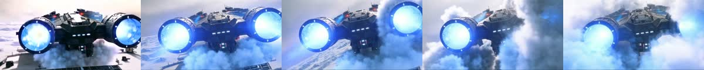

# Wan Video

MLX-Gen supports Wan2.2 text-to-video and image-to-video through `mlxgen generate`, plus plain
prompt-guided video-to-video on `Wan2.2-T2V-A14B`. Use this page for practical size, frame, and
runtime guidance; use [API and CLI](api.md#wan-video) for the full command surface.

## Current Practical Guidance

Wan A14B is the stronger local option in the measured starship example below when you can accept a
smaller canvas. On an Apple M5 Max, a 5.05 second clip at `480x240` or `240x480`, `101` frames,
`20` fps, and `20` to `25` steps takes about 30 minutes in the local profiles below. For the
specific starship prompt shown here, the documented A14B text-to-video result at `480x240` is the
preferred practical setting over TI2V-5B at `832x480`.

TI2V-5B remains useful as the smaller 5B route and supports both text-to-video and first-frame
image-to-video. It uses 32-pixel spatial multiples and is designed around `1280x704` or
`704x1280`; `832x480` is a practical lower-cost size. A `1280x704`, `25` step, `101` frame local
run takes about the same time as the A14B `480x240` profile in this page.
For TI2V-5B, treat smaller canvases below `832x480` as command and prompt-routing checks rather
than visual-quality settings.

Wan uses a flow-matching schedule shift. MLX-Gen uses the selected model's default unless you pass
`--flow-shift`: TI2V-5B defaults to `5.0` for native 720p-class runs, while A14B defaults to `3.0`.
For new 480p-class TI2V-5B checks such as `832x480`, use `--flow-shift 3`.

Plain Wan video-to-video currently stays intentionally narrow:

Plain video-to-video means one source clip plus one text prompt. MLX-Gen uses the source clip as a
motion and composition anchor, then regenerates the video under the prompt. It is useful for broad
whole-scene or whole-subject changes while keeping the overall camera path and clip timing.

- use `Wan-AI/Wan2.2-T2V-A14B-Diffusers` or the matching prepared A14B T2V package;
- pass exactly one `--video` or `--video-path`;
- keep `--solver unipc`;
- use `--video-strength` when you want more or less change from the source clip;
- do not expect frame-accurate preservation, masks, reference images, localized edits, SeedVR2-style restore/upscale behavior, or VACE-style controls on this route;
- do not expect TI2V-5B or I2V-A14B to accept source-video input on the public CLI.

## A14B Size Families

The official A14B quality envelope centers on `480P` and `720P`, but MLX-Gen accepts a broader set
of 16-pixel-multiple target sizes for both A14B routes:

- square: `240x240`, `480x480`, `720x720`, `960x960`, `1280x1280`, `1440x1440`
- portrait targets: `240x480`, `480x832`, `720x1280`, `832x1104`, `1248x1648`, `1080x1920`
- landscape targets: `480x240`, `832x480`, `1280x720`, `1104x832`, `1648x1248`, `1920x1080`

Practical reading:

- `480x240` / `240x480`: quick local previews
- `832x480` / `480x832`: strong lower-cost working sizes
- `1280x720` / `720x1280`: better presentation-quality targets

For A14B image-to-video, treat these as target size classes rather than exact guarantees. MLX-Gen
preserves the source image aspect ratio and resolves to the nearest supported canvas.

## Example Prompt

The comparison clips use this prompt:

```text
A cinematic wide-angle movie shot of a massive futuristic starship taking off from a frozen tundra. The ship features sleek dark metallic armor. Two massive warp nacelles pulsate with intensely glowing blue plasma. Violent snow squalls and heavy blizzards whip around the hull. The swirling snow is illuminated by stark volumetric blue light from the engines. The camera slowly tilts up. The camera simulates a violent shake as the thrusters ignite. Massive clouds of pristine white snow and ice blast away from the launch pad. Photorealistic, highly detailed, dramatic lighting.
```

## M5 Max Comparison Clips

| Model | Size | Steps | Frames / FPS | Approx. time on M5 Max | Asset |
| --- | ---: | ---: | ---: | ---: | --- |
| Wan2.2 TI2V-5B | `832x480` | 25 | 101 / 20 | 12 min | [MP4](assets/examples/wan-video-comparison/wan22-ti2v-5b-832x480-25steps-20fps-101frames.mp4) |
| Wan2.2 T2V-A14B | `480x240` | 25 | 101 / 20 | 30 min | [MP4](assets/examples/wan-video-comparison/wan22-t2v-14b-480x240-25steps-20fps-101frames.mp4) |
| Wan2.2 TI2V-5B | `1280x704` | 25 | 101 / 20 | 35 min | [MP4](assets/examples/wan-video-comparison/wan22-ti2v-5b-1280x704-25steps-20fps-101frames.mp4) |

### TI2V-5B At 832x480


<video controls src="assets/examples/wan-video-comparison/wan22-ti2v-5b-832x480-25steps-20fps-101frames.mp4"></video>

### T2V-A14B At 480x240



<video controls src="assets/examples/wan-video-comparison/wan22-t2v-14b-480x240-25steps-20fps-101frames.mp4"></video>

### TI2V-5B At 1280x704


<video controls src="assets/examples/wan-video-comparison/wan22-ti2v-5b-1280x704-25steps-20fps-101frames.mp4"></video>

## Command Shape

Use A14B T2V when the prompt does not need an input image:

```sh
mlxgen generate \
  --model AbstractFramework/wan2.2-t2v-a14b-diffusers-8bit \
  --prompt "A cinematic wide-angle movie shot of a massive futuristic starship taking off from a frozen tundra. The ship features sleek dark metallic armor. Two massive warp nacelles pulsate with intensely glowing blue plasma. Violent snow squalls and heavy blizzards whip around the hull. The swirling snow is illuminated by stark volumetric blue light from the engines. The camera slowly tilts up. The camera simulates a violent shake as the thrusters ignite. Massive clouds of pristine white snow and ice blast away from the launch pad. Photorealistic, highly detailed, dramatic lighting." \
  --width 480 \
  --height 240 \
  --frames 101 \
  --steps 25 \
  --guidance 4 \
  --guidance-2 3 \
  --fps 20 \
  --seed 42 \
  --output starship_takeoff_a14b.mp4
```

Use TI2V-5B when you want the 5B route or first-frame image-to-video route:

```sh
mlxgen generate \
  --model AbstractFramework/wan2.2-ti2v-5b-diffusers-8bit \
  --prompt "A cinematic wide-angle movie shot of a massive futuristic starship taking off from a frozen tundra. The ship features sleek dark metallic armor. Two massive warp nacelles pulsate with intensely glowing blue plasma. Violent snow squalls and heavy blizzards whip around the hull. The swirling snow is illuminated by stark volumetric blue light from the engines. The camera slowly tilts up. The camera simulates a violent shake as the thrusters ignite. Massive clouds of pristine white snow and ice blast away from the launch pad. Photorealistic, highly detailed, dramatic lighting." \
  --width 832 \
  --height 480 \
  --frames 101 \
  --steps 25 \
  --guidance 5 \
  --flow-shift 3 \
  --fps 20 \
  --seed 42 \
  --output starship_takeoff_ti2v5b.mp4
```

For native TI2V-5B runs at `1280x704` or `704x1280`, omit `--flow-shift` or pass `--flow-shift 5`.
For image-to-video, pass one `--image`. A14B I2V uses the separate
`AbstractFramework/wan2.2-i2v-a14b-diffusers-8bit` package; TI2V-5B uses the same TI2V package and
selects first-frame image-to-video when one image is supplied.

Use TI2V-5B image-to-video like this:

```sh
mlxgen generate \
  --model AbstractFramework/wan2.2-ti2v-5b-diffusers-8bit \
  --image docs/assets/examples/spaceship-snow/01_t2i_spaceship_snow.png \
  --prompt "A cinematic lift-off from the input frame. Keep the frozen cliffs, snow haze, and sunrise palette while the ship rises with glowing blue engines and drifting snow." \
  --width 832 \
  --height 480 \
  --frames 101 \
  --steps 25 \
  --guidance 5 \
  --flow-shift 3 \
  --fps 20 \
  --seed 42 \
  --output starship_takeoff_ti2v5b_i2v.mp4
```

Use TI2V-5B at its native landscape size like this:

```sh
mlxgen generate \
  --model AbstractFramework/wan2.2-ti2v-5b-diffusers-8bit \
  --prompt "A cinematic wide-angle movie shot of a massive futuristic starship taking off from a frozen tundra. The ship features sleek dark metallic armor. Two massive warp nacelles pulsate with intensely glowing blue plasma. Violent snow squalls and heavy blizzards whip around the hull. The swirling snow is illuminated by stark volumetric blue light from the engines. The camera slowly tilts up. The camera simulates a violent shake as the thrusters ignite. Massive clouds of pristine white snow and ice blast away from the launch pad. Photorealistic, highly detailed, dramatic lighting." \
  --width 1280 \
  --height 704 \
  --frames 101 \
  --steps 25 \
  --guidance 5 \
  --fps 20 \
  --seed 42 \
  --output starship_takeoff_ti2v5b_1280x704.mp4
```

Use A14B I2V like this:

```sh
mlxgen generate \
  --model AbstractFramework/wan2.2-i2v-a14b-diffusers-8bit \
  --image docs/assets/examples/spaceship-snow/01_t2i_spaceship_snow.png \
  --prompt "A cinematic lift-off from the input frame. Keep the same frozen landscape and sunrise tones while the ship rises with snow blast and glowing engines." \
  --width 480 \
  --height 240 \
  --frames 101 \
  --steps 25 \
  --guidance 4 \
  --guidance-2 3 \
  --fps 20 \
  --seed 42 \
  --output starship_takeoff_a14b_i2v.mp4
```

Use A14B T2V for the current plain public video-to-video route. This is the exact accepted proof
command shape:

```sh
mlxgen generate \
  --model AbstractFramework/wan2.2-t2v-a14b-diffusers-8bit \
  --video-path docs/assets/examples/spaceship-snow/06_i2v_a14b_spaceship_takeoff_from_source.mp4 \
  --prompt "Keep the same icy cliffs, snow haze, soft sunrise lighting, and lift-off camera motion. Transform the ship into a bulkier smuggler-style starship with a bright circular rear reactor and two side nacelles while preserving realistic vehicle detail." \
  --negative-prompt "Bright tones, overexposed, static, blurred details, subtitles, paintings, still picture, low quality, JPEG residue, duplicate ships, warped hull, melted nacelles, unreadable reactor, washed out frame, blown highlights" \
  --width 448 \
  --height 256 \
  --frames 17 \
  --steps 3 \
  --guidance 4 \
  --guidance-2 3 \
  --video-strength 0.7 \
  --solver unipc \
  --fps 10 \
  --seed 4242 \
  --low-ram \
  --output starship_v2v_a14b.mp4
```

The accepted proof used this source clip:
[06_i2v_a14b_spaceship_takeoff_from_source.mp4](assets/examples/spaceship-snow/06_i2v_a14b_spaceship_takeoff_from_source.mp4)

Preserved proof artifacts:

- output video: [ship_a14b_q8_native.mp4](../validation_outputs/v2v_native_a14b_q8_patched_2026_07_03/ship_a14b_q8_native.mp4)
- source contact sheet: [ship_source_contact_sheet.png](../validation_outputs/v2v_cli_proof_2026_07_03/ship_source_contact_sheet.png)
- output contact sheet: [ship_cli_q8_contact_sheet.png](../validation_outputs/v2v_cli_proof_2026_07_03/ship_cli_q8_contact_sheet.png)
